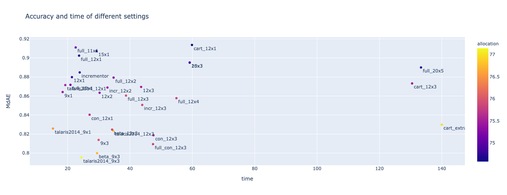
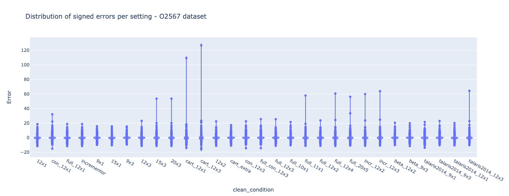
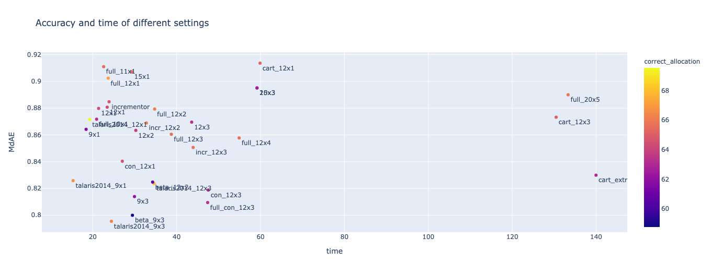

# Benchmarks of the ∆∆G calculations in Venus

[Venus](https://venus.sgc.ox.ac.uk/) does not do a full minimisation but cheats by only minimising the neighbourhood 
before and after introducing the variant.
Therefore, it is important to assess the accuracy of Venus ddG calculations.

## Analysis overview
The analyses were done on the cluster and not via the production webserver both for questions of loading
and because Venus works on Uniprot canonical isoform numbering whereas the datasets used rely on PDB numbering.
However, these options are available to the general user in `Avanced settings` button.

The datasets used where the less-biased ProTherm datasets from

* **O2567**: [Caldararu et al. 2020](https://pubs.acs.org/doi/abs/10.1021/acs.jcim.0c00591)
* **ProTherm&lowast;**: [Frenz et al. 2020](https://www.ncbi.nlm.nih.gov/pmc/articles/PMC7579412/)

Both datasets provide empirical kcal/mol and residue indices as PDB residue indices —the code nevertheless checked
that the starting residue was consistent.

The ProTherm&lowast; dataset was scored and analysed first with several alteration, but in the final set of analyses
the O2567 dataset was used.

## Scoring
> For the code used for the O2567 dataset see [scoring](O2567_scoring.md).
> For the (older) code used for the ProTherm-star dataset see [scoring](ProTherm-star_scoring.md).

### Setup
The data was scored via the [protein module of Michelanglo](https://github.com/matteoferla/MichelaNGLo-protein-module) 
in a Jupyter notebook port-forwarded from a cluster node (x32 Intel Xeon (Haswell, x86_64) CPU E5-2640 v3 @ 2.60GHz)
with PyRosetta4 release 2020.49 (Dec2020) for python37 on Linux.

The data was stored with SqliteDict in case of interruption 
(SqliteDict is basically a dict with permanence). To prevent segmentation faults the instance of the 
`ProteinAnalyser` class of Venus instantiates the `Mutator` class that performs the PyRosetta operations
in a child process as coded in `ProteinAnalyser.analyse_FF` —
see [blog post for explanation](https://blog.matteoferla.com/2020/02/working-around-segmentation-faults-of.html). 
For parallelisation this setting was also also applied.

### Parameters
Several settings were tried. Here reported are the results from the final iteration of the codebase.
The settings tested were:

* neighbourhood radius
* scorefunction
* cartesian or dihedral
* scoring globally or only neighbourhood
* constraining the boundary of the neighbourhood
* rejecting worse values after a minimisation

NB. that neighbourhood is written accidentally in British English in the code.

Additionally, silent mutation for the dataset were tested with x3 cycles, 12 Å neighbourhood and ref2015 scorefunction.
This was done to verify that the score is always zero.

### Scorefunctions

> For more about scorefunction choice see [scorefunction notes](scorefunction.md).

Three generations of scorefunction were tested `talaris2014` (old default), `ref2015` (the current default) and `beta_nov16`.

In the Rosetta database folder there are two scorefunction derived from this paper and another paper, 
where `beta_nov15`, became `ref2015` and is further described in [Alford et al. 2017](https://www.ncbi.nlm.nih.gov/pmc/articles/PMC5717763/).
However, there is also `beta_nov16`, which is labelled as "parameter refitting (Frank DiMaio and Hahnbeom Park), November 2016".
This appears to the last one added. But there is no paper about it and it is not discussed elsewhere.

One thing to note is that the scorefunctions are calibrated to be proportional to kcal/mol, but are not a direct match,
as stated in the supplementary information in [Park et al. 2016](https://dx.doi.org/10.1021/acs.jctc.6b00819).

> Scaling factors are introduced to fit the overall scale of estimated values to actual experimental free energies measured in kcal/mole. 

As a result a scaling factor used was the median of the ratio of the experimental values over the calculated values.
The scaling factor obtained was 4.2&times;. This is a very similar value to the conversion factor from kJ to kcal, 
but I have checked in Rosetta Commons where it was confirmed it is coincidental.

The different scorefunctions beyond ref2015 were used with the appropriate corrections flag. Example:

```python
pyrosetta.rosetta.basic.options.set_boolean_option('corrections:beta_nov16', True)
```

### Cartesian
In [Park et al. 2016](https://www.ncbi.nlm.nih.gov/pmc/articles/PMC5515585/) cartesian FastRelax is found to be better,
So cartesian space was tested.
The difference between cartesian and dihedral space is that in the former all atoms have a x,y,z position
relative to the origin of the system (0,0,0), while in dihedral space each atom has a position relative
to its antecedent neighbours by distance, angle and dihedral angle. Dual space is a mix of the two.
In terms of scorefunctions, dihydral scorefunctions have non-zero `pro_close` terms, while cartesian scorefunctions
have non-zero `cart_bonded_length`, `cart_bonded_torsion`, `cart_bonded_angle` terms, but the rest of the parameters,
including the `ref` terms (aminoacid specific fudge factors) are the same between the regular and the cartesian versions.

Venus applies the following settings to the FastRelax mover instance for cartesian scorefunctions:

    relax.cartesian(True)
    relax.minimize_bond_angles(True)
    relax.minimize_bond_lengths(True)

LocalRelax mover is great for its speediness for large complexes 
and uses cartesian space to start with on an unminimised structure,
but is tailored to use a specific scorefunction and is not suitable for ∆∆G calculations.

## Results
> For the analyses on the ProTherm&lowast; dataset see [O2567_analyses](O2567_analyses.md)
> For the initial analyses on the ProTherm&lowast; dataset see [ProTherm-star_initial_analyses](ProTherm-star_initial_analyses.md)
> For the second analyses on the ProTherm&lowast; dataset see [ProTherm-star_second_analyses](ProTherm-star_analyses.md)


The results were consistent between datasets, therefore herein are reported the final analyses.
Also the alteration of settings resulted in only mild difference in scores:



One issue is that there are severe outliers. The fences under most settings are less than ±4 kcal/mol,
but the outliers can go upto 126 kcal/mol.
This is driven by the inability to un-distort a clash requiring large scale backbone corrections.
Venus frontend shows ∆∆G greater than 10 kcal/mol as "> 10 kcal/mol".



For analytical purposes, median is used herein instead of mean because:

* it is not sensitive to outliers —especially given that the amount of values beyond 5 kcal/mol are unimportant
* some samples show large deviation, non-zero skew and non-three kurtosis

Standard deviation is based on the mean, the median equivalent is the
[median absolute deviation (MAD)](https://en.wikipedia.org/wiki/Median_absolute_deviation).
MAD in a normal distribution does not match the deviation, as it is ~0.67 the size of the latter 
—median and mean differ depending on skewness (positive skew => lower median than mean), which likewise affect MAD.

Pearson &rho; is the ratio of covariance over the product of deviations and
[cannot be converted to median form rigorously](median_Pearson.md). 


