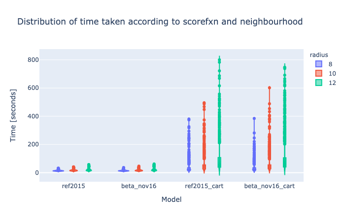
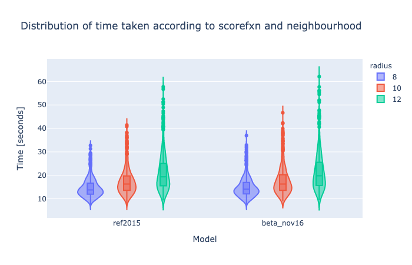
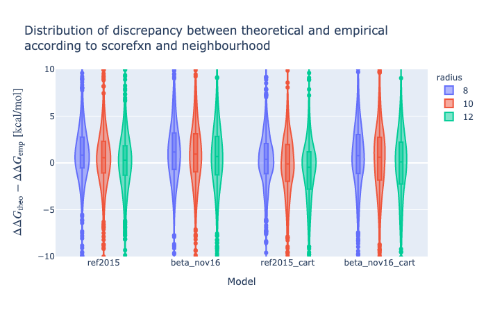
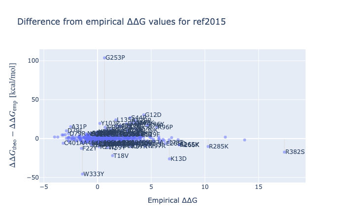

# validation_of_venus_ddG
Tests to assess the accuracy of Venus ddG calculations.

Venus does not do a full minimisation but cheats by only minimising the neighbourhood before and after introducing the variant.

First, the data was scored via the protein module of Michelanglo —see [scoring Jupyter notebook](scoring.md)—.
Then it was analysed —see [analyse Jupyter notebook](analyse.md).

The dataset used the less-biased ProTherm dataset from [Frenz et al. 2020](https://www.ncbi.nlm.nih.gov/pmc/articles/PMC7579412/).
This provides empirical kcal/mol and residue indices as PDB residue indices —the code nevertheless checked
that the starting residue was consistent.

Three axes were tested, at first, to assess the effect of:

* neighbourhood radius
* scorefunction
* cartesian or dihedral

NB. that neighbourhood is written accidentally in British English in the code

Additionally, silent mutation for the dataset were tasted with x3 cycles, 12 Å neighbourhood and ref2015 scorefunction.

Subsequently:

* scoring globally or only neighbourhood
* constraining the boundary of the neighbourhood
* preventing relax from outputting a worse value

## Scorefunctions, radius and cartersian

In [Park et al. 2016](https://www.ncbi.nlm.nih.gov/pmc/articles/PMC5515585/) cartesian FastRelax is suggested to be better,
LocalRelax mover (for complexes) uses cartesian space to start with. So cartesian space was tested.

In the Rosetta database folder there are two scorefunction derived from this paper and another paper, 
where `beta_nov15`, became `ref2015` and is further described in [Alford et al. 2017](https://www.ncbi.nlm.nih.gov/pmc/articles/PMC5717763/).
However, there is also `beta_nov16`, which is labelled as "parameter refitting (Frank DiMaio and Hahnbeom Park), November 2016".
This appears to the last one added. But I cannot figure out if it is better as a general scorefunction.
Hence it's addition to the tests. For more about scorefunction choice see [scorefunction notes](scorefunction.md).

### Time

Time cost is an important factor for Venus.

#### Cartesian

The cartesian scorefunctions perform extremely poorly in terms of consistency.

A 12 Å neighbourhood takes on average 21.1 s and has a standard deviation of 7.8 s with the ref2015 scorefunction,
but takes 104.7 s and 118 s. This is most likely an unacceptable timeframe for user facing calculations.

#### Radius

A radius of 8 Å from the C&beta; atom encompasses on average 10.2 Å, 10 Å encompasses 16.9 and 12 Å encompasses 26.6.

The ref2015 scorefunction takes on average 14.7 s, 17.4 s, 21.1 s for 8, 10, 12 Å radius neighbourhood.

A seven second difference is nothing to worry about.

### Accuracy

The ProTerm dataset contains empirical ∆∆G. So how off is the dataset?

At 12 Å, the ref2015 is off on average by +0.6 kcal/mol, while the beta_nov16 is off by +1.1 kcal/mol, 
while their cartesian versions are off by -1.1 kcal/mol and -0.3 kcal/mol.
The spread differs between the `ref2015` and `beta_nov16` scorefunctions.
Visually, they do not appear to be skewed, but seem to have some kurtosis. Which is confirmed statistically:

|    | scorefxn_name   |   mean |   std |   median |   iqr |   skew |   kurtosis |
|---:|:----------------|-------:|------:|---------:|------:|-------:|-----------:|
|  0 | ref2015         |    0.6 |   6.2 |      0.3 |   3.1 |    6.3 |      110.6 |
|  1 | ref2015_cart    |   -1.1 |   5.1 |     -0.5 |   4   |   -1.3 |        9   |
|  2 | beta_nov16      |    1.1 |   6.1 |      0.7 |   4.1 |    6.6 |      102.4 |
|  3 | beta_nov16_cart |   -0.3 |   5.1 |      0.1 |   4.5 |   -1   |        7.1 |

These values are heavily affected by high ∆∆G values. Hence the large positive skewness.

Setting all values > 10 or < -10 to ±10 and removing all cases where both empirical and theoretical are 10.

|    | scorefxn_name   |   mean |   std |   median |   iqr |   skew |   kurtosis |
|---:|:----------------|-------:|------:|---------:|------:|-------:|-----------:|
|  0 | ref2015         |    0.2 |   3.3 |      0.3 |   3.1 |   -0.3 |        2   |
|  1 | ref2015_cart    |   -1   |   3.9 |     -0.5 |   4   |   -0.5 |        1.2 |
|  2 | beta_nov16      |    0.7 |   3.6 |      0.7 |   4.1 |   -0.3 |        0.8 |
|  3 | beta_nov16_cart |   -0.3 |   4.1 |      0.1 |   4.5 |   -0.5 |        0.9 |

The skew goes down but the kurtosis goes below 3.
The ref2015 scorefunction or the beta_nov16_cart are attractive, although the latter is more centered,
it has a flatter distribution.

This is very clear when the cutoff is moved to an unreasonable ±5.

|    | scorefxn_name   |   mean |   std |   median |   iqr |   skew |   kurtosis |
|---:|:----------------|-------:|------:|---------:|------:|-------:|-----------:|
|  0 | ref2015         |    0   |   2.5 |      0.3 |   2.9 |   -0.5 |        0.7 |
|  1 | ref2015_cart    |   -0.9 |   2.9 |     -0.5 |   3.8 |   -0.3 |       -0   |
|  2 | beta_nov16      |    0.4 |   2.7 |      0.6 |   3.6 |   -0.5 |        0.1 |
|  3 | beta_nov16_cart |   -0.3 |   3   |      0.1 |   4.2 |   -0.4 |       -0.3 |

Therefore, ref2015 is indeed the better scorefunction for Venus.

These problematic outliers are not only proline mutations, so nothing needs to be altered to address this.

### Summary

Setting the C&beta; neighbourhood to a 12 Å (default was 8 Å and before that via PyMOL neighbourhood, which was a bad idea in hindsight)
takes on average 21.1 s with the default scorefunction (ref2015) and encompasses on average 26.6 neighbouring residues.

The ref2015 scorefunction gives on average scores +0.6 kcal/mol that the empirical values, 
but this is driven by strongly destabilitizing and stabilising mutations and their exclusion removes this.
The cartesian modality, seems better with the beta_nov16 weight set, and better addresses the scores in the highly disruptive variants,
 but is very much slower.