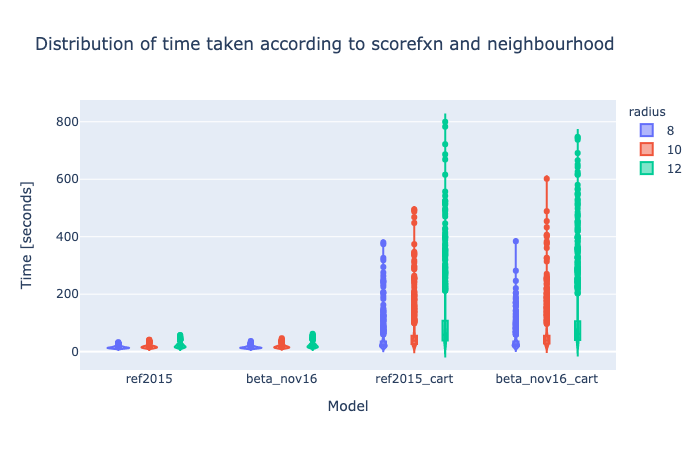
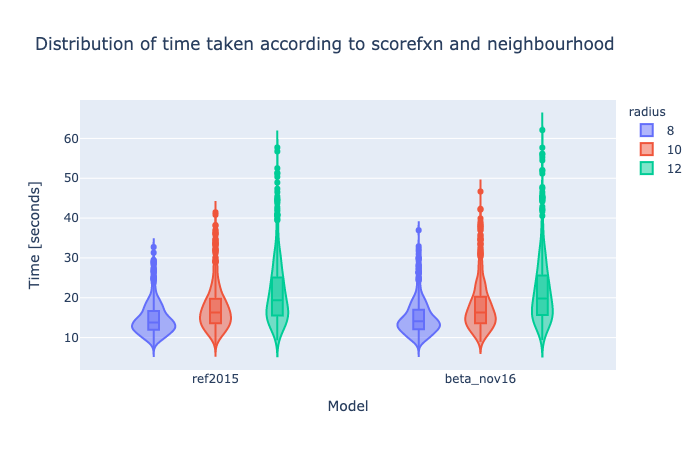

## Step 2. Analysis

> This is a modified Markdown-exported version of the notebook (see [data](data) for actual notebook)

## IO

Scoring notebook created an sqlite dictionary (a Python dictionary with permanence).

To pandas.

```python
import json
import pandas as pd
from sqlitedict import SqliteDict
db_scores = SqliteDict('data/scores.db', encode=json.dumps, decode=json.loads, autocommit=True)
scores = pd.DataFrame(dict(db_scores.items())).transpose()
scores.head(5)
```

<div>
<table border="1" class="dataframe">
  <thead>
    <tr style="text-align: right;">
      <th></th>
      <th>PDB ID</th>
      <th>Protherm ID</th>
      <th>Residue Number</th>
      <th>Chain</th>
      <th>Wild Type</th>
      <th>Mutation</th>
      <th>SASA</th>
      <th>Experimental DDG</th>
      <th>Classifiers</th>
      <th>PDB_chain</th>
      <th>mutation</th>
      <th>uniprot</th>
      <th>radius</th>
      <th>use_pymol_for_neighbours</th>
      <th>ddG</th>
      <th>neighs</th>
      <th>scorefxn_name</th>
      <th>time</th>
    </tr>
  </thead>
  <tbody>
    <tr>
      <th>2199_ref2015_8</th>
      <td>1STN</td>
      <td>2199</td>
      <td>122</td>
      <td>A</td>
      <td>E</td>
      <td>F</td>
      <td>0.2249</td>
      <td>0.8</td>
      <td>'polar to hydrophobic' 'negative to hydrophobi...</td>
      <td>1STN_A</td>
      <td>E122F</td>
      <td>P00644</td>
      <td>8</td>
      <td>False</td>
      <td>2.5621</td>
      <td>11</td>
      <td>ref2015</td>
      <td>9.55795</td>
    </tr>
    <tr>
      <th>2199_beta_nov16_8</th>
      <td>1STN</td>
      <td>2199</td>
      <td>122</td>
      <td>A</td>
      <td>E</td>
      <td>F</td>
      <td>0.2249</td>
      <td>0.8</td>
      <td>'polar to hydrophobic' 'negative to hydrophobi...</td>
      <td>1STN_A</td>
      <td>E122F</td>
      <td>P00644</td>
      <td>8</td>
      <td>False</td>
      <td>-0.0440791</td>
      <td>11</td>
      <td>beta_nov16</td>
      <td>9.33401</td>
    </tr>
    <tr>
      <th>2199_ref2015_10</th>
      <td>1STN</td>
      <td>2199</td>
      <td>122</td>
      <td>A</td>
      <td>E</td>
      <td>F</td>
      <td>0.2249</td>
      <td>0.8</td>
      <td>'polar to hydrophobic' 'negative to hydrophobi...</td>
      <td>1STN_A</td>
      <td>E122F</td>
      <td>P00644</td>
      <td>10</td>
      <td>False</td>
      <td>1.79129</td>
      <td>17</td>
      <td>ref2015</td>
      <td>11.8185</td>
    </tr>
    <tr>
      <th>2199_beta_nov16_10</th>
      <td>1STN</td>
      <td>2199</td>
      <td>122</td>
      <td>A</td>
      <td>E</td>
      <td>F</td>
      <td>0.2249</td>
      <td>0.8</td>
      <td>'polar to hydrophobic' 'negative to hydrophobi...</td>
      <td>1STN_A</td>
      <td>E122F</td>
      <td>P00644</td>
      <td>10</td>
      <td>False</td>
      <td>1.34752</td>
      <td>17</td>
      <td>beta_nov16</td>
      <td>11.038</td>
    </tr>
    <tr>
      <th>2199_ref2015_12</th>
      <td>1STN</td>
      <td>2199</td>
      <td>122</td>
      <td>A</td>
      <td>E</td>
      <td>F</td>
      <td>0.2249</td>
      <td>0.8</td>
      <td>'polar to hydrophobic' 'negative to hydrophobi...</td>
      <td>1STN_A</td>
      <td>E122F</td>
      <td>P00644</td>
      <td>12</td>
      <td>False</td>
      <td>1.89625</td>
      <td>28</td>
      <td>ref2015</td>
      <td>14.157</td>
    </tr>
  </tbody>
</table>
</div>

Overall Pearson &rho;


```python
from scipy.stats import pearsonr

r, pval = pearsonr(scores['Experimental DDG'], scores.ddG)
f'Pearson rho = {r:.2} & p-value = {pval:.2}'
```


    'Pearson rho = 0.34 & p-value = 1.5e-228'


Pearson &rho; for ref2015 and neighbourhood 12 &Aring;

```python
maxout = lambda value: value if abs(value) < 10 else 10 * value/abs(value)
scores['ddG_emp_maxed'] = scores['Experimental DDG'].apply(maxout)
scores['ddG_theo_maxed'] = scores.ddG.apply(maxout)
r12_scores = scores.loc[(scores.scorefxn_name == 'ref2015') & (scores.radius == 12)]
r, pval = pearsonr(r12_scores.ddG_emp_maxed, r12_scores.ddG_theo_maxed)
f'Pearson rho = {r:.2} & p-value = {pval:.2}'
```


    'Pearson rho = 0.43 & p-value = 3.9e-34'

## Time

```python
# time violins
import plotly.express as px

scores['mode'] = scores.apply(lambda row: f'{row.scorefxn_name} - {row.radius} Å', 1)

fig = px.violin(scores,
                x="scorefxn_name",
                y="time",
                color="radius",
                box=True,
#                 color_discrete_map={'ref2015 - 8 Å': '#5aded3',
#                                     'beta_nov16 - 8 Å': '#fcaca3',
#                                     'ref2015 - 10 Å': 'turquoise',
#                                     'beta_nov16 - 10 Å': 'salmon',
#                                     'ref2015 - 12 Å': '#23afa4',
#                                     'beta_nov16 - 12 Å': '#f85441'},
                title='Distribution of time taken according to scorefxn and neighbourhood')
fig.update_layout({'xaxis': {'anchor': 'y', 'title': {'text': 'Model'}},
               'yaxis': {'anchor': 'x', 'title': {'text': 'Time [seconds]'}}})
fig.show()
```



```python
# time violins
import plotly.express as px

scores['mode'] = scores.apply(lambda row: f'{row.scorefxn_name} - {row.radius} Å', 1)

fig = px.violin(scores.loc[~scores.scorefxn_name.str.contains('cart')],
                x="scorefxn_name",
                y="time",
                color="radius",
                box=True,
#                 color_discrete_map={'ref2015 - 8 Å': '#5aded3',
#                                     'beta_nov16 - 8 Å': '#fcaca3',
#                                     'ref2015 - 10 Å': 'turquoise',
#                                     'beta_nov16 - 10 Å': 'salmon',
#                                     'ref2015 - 12 Å': '#23afa4',
#                                     'beta_nov16 - 12 Å': '#f85441'},
                title='Distribution of time taken according to scorefxn and neighbourhood')
fig.update_layout({'xaxis': {'anchor': 'y', 'title': {'text': 'Model'}},
               'yaxis': {'anchor': 'x', 'title': {'text': 'Time [seconds]'}}})
fig.show()
```




## Discrepancy

```python
scores['mode'].unique()
```


    array(['ref2015 - 8 Å', 'beta_nov16 - 8 Å', 'ref2015 - 10 Å',
           'beta_nov16 - 10 Å', 'ref2015 - 12 Å', 'beta_nov16 - 12 Å',
           'ref2015_cart - 8 Å', 'beta_nov16_cart - 8 Å',
           'ref2015_cart - 10 Å', 'beta_nov16_cart - 10 Å',
           'ref2015_cart - 12 Å', 'beta_nov16_cart - 12 Å'], dtype=object)


```python
# time violins
import plotly.express as px

scores['deviation'] = scores.apply(lambda row: row.ddG - row["Experimental DDG"], 1)

fig = px.violin(scores,
                x="scorefxn_name",
                y="deviation",
                color="radius",
                box=True,
                title='Distribution of discrepancy between theoretical and empirical<br>according to scorefxn and neighbourhood',
               )

fig.update_layout({'xaxis': {'anchor': 'y', 'title': {'text': 'Model'}},
                   'yaxis': {'anchor': 'x',
                            'range': [-10, 10], 
                             'title': {'text': '$\Delta\Delta G_{\mathrm{theo}} - \Delta\Delta G_{\mathrm{emp}}\  \mathrm{[kcal/mol]}$'}
                            }
                  })

fig.show()
```


```python
scores.loc[(scores.scorefxn_name == 'ref2015') & (scores.radius == 12)].deviation.describe()
```


    count    731.000000
    mean       0.578679
    std        6.194438
    min      -45.574877
    25%       -1.320204
    50%        0.296387
    75%        1.822933
    max      103.711557
    Name: deviation, dtype: float64


In the ref2015 scorefunction at 12 Å neighbourhood, the interquadrile range is -1.3 to 1.8 kcal/mol, with a median of 0.3 kcal/mol and a mean of 0.6 kcal/mol —ideally these would be 0 kcal/mol.


```python
# deviation scatter
import plotly.express as px

fig = px.scatter(scores.loc[(scores.radius == 12) & (~scores.scorefxn_name.str.contains('cart'))],
                x="Experimental DDG",
                y="ddG",
                color="mode",
                opacity=0.5,
                title='Calculated vs. empirical ∆∆G values<br>according to scorefxn and neighbourhood',
                color_discrete_map={'ref2015 - 8 Å': '#5aded3',
                                    'beta_nov16 - 8 Å': '#fcaca3',
                                    'ref2015 - 10 Å': 'turquoise',
                                    'beta_nov16 - 10 Å': 'salmon',
                                    'ref2015 - 12 Å': '#23afa4',
                                    'beta_nov16 - 12 Å': '#f85441'},
                color_discrete_sequence=["aquamarine", "salmon", "turquoise", "coral", "teal", "darkcoral"],)
fig.update_layout({'xaxis': {'anchor': 'y', 'title': {'text': 'Empirical'}},
               'yaxis': {'anchor': 'x',
                        # 'range': [-5, 5], 
                         'title': {'text': 'Calculated'}}})

shapes = []
for pro_id in scores['Protherm ID']:
    if f'{pro_id}_ref2015_12' not in scores.index:
        continue
    elif f'{pro_id}_beta_nov16_12' not in scores.index:
        continue
    else:
        ref = scores.loc[f'{pro_id}_ref2015_12']
        beta = scores.loc[f'{pro_id}_beta_nov16_12']
        if abs(ref.ddG - beta.ddG) > 4:
            shapes.append(dict(type="line",
                                 xref='x',
                                 yref='y',
                                  x0=ref["Experimental DDG"],
                                  y0=ref.ddG,
                                  x1=beta["Experimental DDG"],
                                  y1=beta.ddG,
                                    line=dict(
                                        color="gainsboro",
                                        width=1,
                                        #dash="dot",
                                    )
                                )
                             )
            
shapes.append(dict(type="line",
                 xref='x',
                 yref='y',
                  x0=-5,
                  y0=-5,
                  x1=15,
                  y1=15,
                    line=dict(
                        color="black",
                        width=1,
                        dash="dot",
                        )
                    )
                 )

fig.update_layout(shapes=shapes)
fig.show()
```


```python
# categorise 0-1, 1-2 2-5 5+
# def assign_bin(value):
#     if -2 < value < 2:
#         return 0
#     elif value <= -2:
#         return -1
#     else:
#         return 1
    
def assign_bin(value):
    if value < 2:
        return 0
    else:
        return 1
    
scores["bin_emp"] = scores["Experimental DDG"].apply(assign_bin)
scores["bin_theo"] = scores["ddG"].apply(assign_bin)

scores["bin_sign"] = scores.bin_emp == scores.bin_theo
```


```python
pivoted = scores[['mode','bin_sign']]\
                .pivot_table(index='mode',
                             columns=['bin_sign'],
                             aggfunc=len, 
                             fill_value=0
                            )
pivoted.columns = ['incorrect', 'correct']
pivoted['ratio'] = pivoted.correct/(pivoted.correct + pivoted.incorrect)
pivoted.index.name = None
split = pivoted.index.to_series().str.split(' - ',expand=True)
pivoted['scorefxn_name'] = split[0]
pivoted['radius'] = split[1]
```


```python
import plotly.express as px

fig = px.bar(pivoted,
             x='radius',
             y='ratio', color="scorefxn_name",
             title="Fraction in agreement in '> 2 kcal/mol' bin assignment")
fig.update_layout(barmode='group')
fig.show()
```


```python
scores['dev_bin'] = scores.deviation < 1

pivoted = scores[['mode','dev_bin']]\
                .pivot_table(index='mode',
                             columns=['dev_bin'],
                             aggfunc=len, 
                             fill_value=0
                            )
pivoted.columns = ['incorrect', 'correct']
pivoted['ratio'] = pivoted.correct/(pivoted.correct + pivoted.incorrect)
pivoted.index.name = None
split = pivoted.index.to_series().str.split(' - ',expand=True)
pivoted['scorefxn_name'] = split[0]
pivoted['radius'] = split[1].str.extract('(\d+)')
```


```python
import plotly.express as px

fig = px.bar(pivoted,
             x='radius',
             y='ratio', color="scorefxn_name",
             title="Fraction with less than 1 kcal/mol error")
fig.update_layout(barmode='group')
fig.show()
```


```python
scores.to_csv('scores.csv')
```
