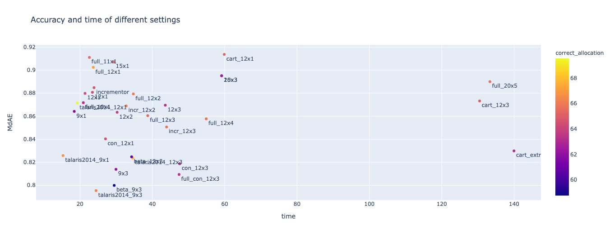

> This is copypaste of some cells of a Jupyter notebook

## Read data
To make sure every setting is on an equal footing all cases that raised an error are removed across the board.
 Resulting in `cleanscores` dataframe.

```python
import json
import pandas as pd
pd.options.mode.chained_assignment = None
import numpy as np
from sqlitedict import SqliteDict
results = SqliteDict('O2567-scores.db', encode=json.dumps, decode=json.loads, autocommit=True)
from IPython.display import display, HTML

def entitle(*args, header='h1'):
    content = ' &mdash; '.join(map(str, args))
    display(HTML(f'<{header}>{content}</{header}>'))
    
# ============ Load data ===================
entitle('Loading data')
db_scores = SqliteDict('O2567-scores.db', encode=json.dumps, decode=json.loads, autocommit=True)
scores = pd.DataFrame(dict(db_scores.items())).transpose()
print(f'{len(scores)} datapoints...')
scores['Experimental ddG'][scores.silent] = 0.
scores['flipped_experimental_ddG'] = - scores['Experimental ddG']
scores['has_pro'] = scores.mutation.str.contains('P')
scores['time'] = scores.time.astype(float)
scores['ddG'] = scores.ddG.astype(float)

keys = scores['PDB code']+'_'+scores['Wild']+scores['Residue number'].astype(str)+scores['Mutated']
bad_keys = keys[pd.to_numeric(scores.ddG, errors='coerce').isna()]
cleanscores = scores.loc[~keys.isin(bad_keys.values)]
cleanscores.at[cleanscores.ddG == 0., 'ddG'] = 0.01
cleanscores['ratio'] = cleanscores.flipped_experimental_ddG / cleanscores.ddG  # 1 match. > under
entitle('ratios')
ratios = pd.pivot_table(cleanscores, values=['ratio'], index=['condition'], aggfunc='median')
display(ratios)
scores['MSE'] = (scores['ddG'] * scores['condition'].map(ratios.ratio.to_dict()) - scores['flipped_experimental_ddG']).astype(float)
scores['MAE'] = scores['MSE'].apply(abs).astype(float)

def allocate_row(row):
    weight = ratios.ratio.to_dict()[row.condition]
    ddG = row.ddG  * weight
    if abs(row.flipped_experimental_ddG - ddG) < 0: #0.5:
        return True
    elif row.flipped_experimental_ddG > 2 and ddG > 2:
        return True
    elif row.flipped_experimental_ddG < 2 and ddG < 2:
        return True
    else:
        return False
scores['allocation'] = scores.apply(allocate_row, 1)

cleanscores = scores.loc[~keys.isin(bad_keys.values)]
```

75814 datapoints...

| condition        |    ratio |
|:-----------------|---------:|
| beta_12x2        | 0.241545 |
| beta_9x3         | 0.233231 |
| cart_extra       | 0.291881 |
| cartesian        | 0.219813 |
| cartesian_12x3   | 0.254166 |
| con_12x3         | 0.254801 |
| default          | 0.215978 |
| full_10x1        | 0.245094 |
| full_11x1        | 0.223901 |
| full_12x2        | 0.26624  |
| full_12x3        | 0.283223 |
| full_12x4        | 0.272636 |
| full_20x5        | 0.249367 |
| full_con_12x3    | 0.251911 |
| full_score       | 0.219195 |
| incr_12x2        | 0.265836 |
| incr_12x3        | 0.277024 |
| incrementor      | 0.217082 |
| outer_con        | 0.249993 |
| radius12x1       | 0.214543 |
| radius12x2       | 0.254425 |
| radius12x3       | 0.26062  |
| radius15x1       | 0.188969 |
| radius15x3       | 0.237803 |
| radius20x3       | 0.237803 |
| radius9x1        | 0.260555 |
| radius9x3        | 0.273607 |
| talaris2014_12x1 | 0.263065 |
| talaris2014_12x3 | 0.295821 |
| talaris2014_9x1  | 0.282791 |
| talaris2014_9x3  | 0.298575 |

## View

```python
print(scores.sample(n=10).to_markdown())
```

|                             | PDB code   | Wild   |   Residue number | Mutated   | Chain   |   Experimental ddG |   RSA |   Temperature |   pH | Method   | PDB_chain   | uniprot   | mutation   | silent   | condition        | apriori                                                                                                                          |     time |       ddG | scores                                                                                                                       |       rmsd |      dsol | score_fxn    | neighbours                                                                                                                                                                                                                                                                                                                                                                                                                                                                                                                                                                             |   cycles |   radius | neighbouring_ligand   |   n_constraints |   error |   flipped_experimental_ddG | has_pro   |       MSE |      MAE |
|:----------------------------|:-----------|:-------|-----------------:|:----------|:--------|-------------------:|------:|--------------:|-----:|:---------|:------------|:----------|:-----------|:---------|:-----------------|:---------------------------------------------------------------------------------------------------------------------------------|---------:|----------:|:-----------------------------------------------------------------------------------------------------------------------------|-----------:|----------:|:-------------|:---------------------------------------------------------------------------------------------------------------------------------------------------------------------------------------------------------------------------------------------------------------------------------------------------------------------------------------------------------------------------------------------------------------------------------------------------------------------------------------------------------------------------------------------------------------------------------------|---------:|---------:|:----------------------|----------------:|--------:|---------------------------:|:----------|----------:|---------:|
| 1AIE_E336A_radius12x2       | 1AIE       | E      |              336 | A         | A       |            3       |  76.3 |            25 |  7   | GdnHCl   | 1AIE_A      | P04637    | E336A      | False    | radius12x2       | The mutation changes one amino acid to another that is differently charged, smaller.                                             |  12.542  |  1.29242  | {'raw': 12.337716382883633, 'relaxed': -20.536638428307416, 'mutate': -19.197513489062985, 'mutarelax': -19.24421694962179}  | 0.00920244 | -0.443938 | ref2015      | ['332 A ', '333 A ', '334 A ', '335 A ', '336 A ', '337 A ', '338 A ', '339 A ', '340 A ', '341 A ', '342 A ', '343 A ']                                                                                                                                                                                                                                                                                                                                                                                                                                                               |        2 |       12 | False                 |               0 |     nan |                   -3       | False     |  3.32882  | 3.32882  |
| 1EY0_G88W_full_con_12x3     | 1EY0       | G      |               88 | W         | A       |           -0.955   |   0   |            20 |  7   | GdnHCl   | 1EY0_A      | P00644    | G88W       | False    | full_con_12x3    | The mutation changes one amino acid to another that is bigger, from a non-aromatic to an aromatic, more rigid, more hydrophobic. |  96.8655 |  0.540769 | {'raw': 166.9763598359475, 'relaxed': 87.32839054033946, 'mutate': 2163.417611350858, 'mutarelax': 87.86915969517754}        | 0.119511   | -0.980461 | ref2015      | ['12 A ', '21 A ', '22 A ', '23 A ', '24 A ', '25 A ', '27 A ', '28 A ', '30 A ', '31 A ', '32 A ', '33 A ', '34 A ', '35 A ', '36 A ', '37 A ', '74 A ', '75 A ', '76 A ', '77 A ', '79 A ', '80 A ', '81 A ', '82 A ', '83 A ', '84 A ', '85 A ', '86 A ', '87 A ', '88 A ', '89 A ', '90 A ', '91 A ', '92 A ', '118 A ']                                                                                                                                                                                                                                                           |        3 |       12 | False                 |             246 |     nan |                    0.955   | False     | -0.818775 | 0.818775 |
| 2PPN_E61A_radius12x3        | 2PPN       | E      |               61 | A         | A       |            0.76    |  39   |            25 |  7.5 | Urea     | 2PPN_A      | P62942    | E61A       | False    | radius12x3       | The mutation changes one amino acid to another that is differently charged, smaller.                                             |  44.8981 |  3.65513  | {'raw': -8.942439205940582, 'relaxed': -50.853978787242994, 'mutate': -45.366708795480534, 'mutarelax': -47.19885066617971}  | 0.0513753  | -5.79571  | ref2015      | ['1 A ', '2 A ', '3 A ', '4 A ', '16 A ', '18 A ', '50 A ', '51 A ', '53 A ', '55 A ', '56 A ', '57 A ', '58 A ', '59 A ', '60 A ', '61 A ', '62 A ', '63 A ', '64 A ', '65 A ', '66 A ', '74 A ', '76 A ', '77 A ', '79 A ', '80 A ', '81 A ']                                                                                                                                                                                                                                                                                                                                        |        3 |       12 | False                 |               0 |     nan |                   -0.76    | False     |  1.7126   | 1.7126   |
| 1EY0_A102F_talaris2014_12x1 | 1EY0       | A      |              102 | F         | A       |           -1.9     |  18.7 |            20 |  7   | GdnHCl   | 1EY0_A      | P00644    | A102F      | False    | talaris2014_12x1 | The mutation changes one amino acid to another that is bigger.                                                                   |  24.5655 | -0.492056 | {'raw': 148.66006062106294, 'relaxed': 71.25427036124152, 'mutate': 1499.949322600286, 'mutarelax': 70.76221483125265}       | 0.12275    |  5.69256  | talaris2014  | ['20 A ', '36 A ', '39 A ', '41 A ', '58 A ', '61 A ', '62 A ', '64 A ', '65 A ', '66 A ', '69 A ', '91 A ', '92 A ', '93 A ', '94 A ', '95 A ', '96 A ', '97 A ', '98 A ', '99 A ', '100 A ', '101 A ', '102 A ', '103 A ', '104 A ', '105 A ', '106 A ', '107 A ', '108 A ', '109 A ', '125 A ', '128 A ', '132 A ', '137 A ']                                                                                                                                                                                                                                                       |        1 |       12 | False                 |               0 |     nan |                    1.9     | False     | -2.02944  | 2.02944  |
| 1PGA_E19S_full_con_12x3     | 1PGA       | E      |               19 | S         | A       |            0.1053  |  77   |           nan |  6.5 | GdnHCl   | 1PGA_A      | P06654    | E19S       | False    | full_con_12x3    | The mutation changes one amino acid to another that is differently charged, smaller, more flexible.                              |  26.105  |  0.858895 | {'raw': -19.206862793764344, 'relaxed': -53.259176148070146, 'mutate': -52.23336100438748, 'mutarelax': -52.400281432882515} | 0.0160853  | -0.150895 | ref2015      | ['1 A ', '2 A ', '3 A ', '4 A ', '16 A ', '17 A ', '18 A ', '19 A ', '20 A ', '21 A ', '22 A ', '25 A ', '26 A ', '29 A ', '30 A ', '50 A ']                                                                                                                                                                                                                                                                                                                                                                                                                                           |        3 |       12 | False                 |             133 |     nan |                   -0.1053  | False     |  0.321665 | 0.321665 |
| 1PGA_A48P_radius15x1        | 1PGA       | A      |               48 | P         | A       |            0.01175 |  86   |           nan |  6.5 | GdnHCl   | 1PGA_A      | P06654    | A48P       | False    | radius15x1       | The mutation changes one amino acid to another that is bigger, from a non-aromatic to an aromatic, more flexible, more polar.    |  16.0096 | 15.8166   | {'raw': -26.84972416200435, 'relaxed': -47.81495880601752, 'mutate': 232.31609879137923, 'mutarelax': -31.998313685776285}   | 0.0945475  | -0.126002 | ref2015      | ['1 A ', '2 A ', '3 A ', '4 A ', '6 A ', '23 A ', '26 A ', '44 A ', '45 A ', '46 A ', '47 A ', '48 A ', '49 A ', '50 A ', '51 A ', '52 A ', '53 A ']                                                                                                                                                                                                                                                                                                                                                                                                                                   |        1 |       15 | False                 |               0 |     nan |                   -0.01175 | True      |  3.00061  | 3.00061  |
| 2RN2_D10A_outer_con         | 2RN2       | D      |               10 | A         | A       |            3.3     |  18.4 |            25 |  5.5 | Urea     | 2RN2_A      | P0A7Y4    | D10A       | False    | outer_con        | The mutation changes one amino acid to another that is differently charged, smaller.                                             |  50.9883 | -6.92345  | {'raw': -55.54390219303009, 'relaxed': -88.02531833314937, 'mutate': -92.88546102617677, 'mutarelax': -94.94876461565231}    | 0.0335353  | -7.87596  | ref2015      | ['7 A ', '8 A ', '9 A ', '10 A ', '11 A ', '12 A ', '13 A ', '20 A ', '21 A ', '22 A ', '23 A ', '24 A ', '25 A ', '34 A ', '35 A ', '36 A ', '44 A ', '47 A ', '48 A ', '49 A ', '50 A ', '51 A ', '52 A ', '55 A ', '67 A ', '68 A ', '69 A ', '70 A ', '71 A ', '73 A ', '74 A ', '121 A ', '123 A ', '126 A ', '127 A ', '129 A ', '130 A ', '131 A ', '132 A ', '133 A ', '134 A ', '135 A ', '136 A ', '137 A ', '138 A ', '139 A ', '140 A ', '141 A ']                                                                                                                         |        1 |       12 | False                 |             311 |     nan |                   -3.3     | False     |  1.56919  | 1.56919  |
| 1A2P_L89T_radius15x3        | 1A2P       | L      |               89 | T         | A       |           -2.725   |   0   |            25 |  6.3 | Urea     | 1A2P_A      | P00648    | L89T       | False    | radius15x3       | The mutation changes one amino acid to another that is more polar, differently shaped.                                           |  90.0798 |  7.34982  | {'raw': -89.28078266409693, 'relaxed': -210.0172046538732, 'mutate': -203.2298099192473, 'mutarelax': -202.66738295058565}   | 0.158855   |  3.24785  | ref2015      | ['7 A ', '8 A ', '9 A ', '10 A ', '11 A ', '13 A ', '14 A ', '15 A ', '20 A ', '24 A ', '50 A ', '51 A ', '52 A ', '53 A ', '54 A ', '55 A ', '56 A ', '57 A ', '58 A ', '59 A ', '60 A ', '61 A ', '62 A ', '63 A ', '64 A ', '65 A ', '66 A ', '69 A ', '70 A ', '71 A ', '72 A ', '73 A ', '74 A ', '75 A ', '76 A ', '77 A ', '85 A ', '86 A ', '87 A ', '88 A ', '89 A ', '90 A ', '91 A ', '92 A ', '93 A ', '94 A ', '95 A ', '96 A ', '97 A ', '98 A ', '99 A ', '100 A ', '101 A ', '102 A ', '103 A ', '104 A ', '105 A ', '106 A ', '107 A ', '108 A ', '109 A ', '110 A '] |        3 |       15 | False                 |               0 |     nan |                    2.725   | False     | -0.977189 | 0.977189 |
| 1FEP_E248C_cartesian_12x3   | 1FEP       | E      |              248 | C         | A       |            6.83    |  22.2 |            25 |  7   | GdnHCl   | 1FEP_A      | P05825    | E248C      | False    | cartesian_12x3   | The mutation changes one amino acid to another that is differently charged, smaller.                                             | 243.724  |  0.674187 | {'raw': 110.58980088325086, 'relaxed': -92.24998563268356, 'mutate': -87.21766602485076, 'mutarelax': -91.57579818975007}    | 0.0248747  | -1.49973  | ref2015_cart | ['87 A ', '89 A ', '146 A ', '148 A ', '149 A ', '187 A ', '188 A ', '189 A ', '190 A ', '235 A ', '236 A ', '237 A ', '238 A ', '239 A ', '240 A ', '241 A ', '245 A ', '246 A ', '247 A ', '248 A ', '249 A ', '250 A ', '251 A ', '289 A ', '290 A ', '291 A ', '292 A ', '293 A ', '294 A ', '295 A ', '304 A ', '305 A ', '306 A ', '307 A ', '308 A ']                                                                                                                                                                                                                           |        3 |       12 | False                 |               0 |     nan |                   -6.83    | False     |  7.00136  | 7.00136  |
| 1FNA_L62A_radius12x2        | 1FNA       | L      |               62 | A         | A       |           -2.94    |  11.6 |            25 |  5   | GdnHCl   | 1FNA_A      | P02751    | L62A       | False    | radius12x2       | The mutation changes one amino acid to another that is smaller.                                                                  |  34.2101 |  7.47815  | {'raw': -14.301259647583821, 'relaxed': -96.66124368746, 'mutate': -88.25728153463807, 'mutarelax': -89.18309091950684}      | 0.0654783  |  0.465335 | ref2015      | ['10 A ', '13 A ', '14 A ', '15 A ', '16 A ', '17 A ', '18 A ', '19 A ', '20 A ', '36 A ', '37 A ', '38 A ', '46 A ', '58 A ', '59 A ', '60 A ', '61 A ', '62 A ', '63 A ', '64 A ', '65 A ', '66 A ', '67 A ', '68 A ', '70 A ', '92 A ', '93 A ', '94 A ', '95 A ', '96 A ']                                                                                                                                                                                                                                                                                                         |        2 |       12 | False                 |               0 |     nan |                    2.94    | False     | -1.03737  | 1.03737  |

## Summary

```python
print(len(scores), len(cleanscores))
mae_summary = pd.pivot_table(cleanscores, values=['MAE', 'MSE', 'time'], index=['condition'], aggfunc='median')
mae_summary.columns = mae_summary.columns.to_series().map({'MAE': 'MdAE', 'MSE': 'MdSE', 'time': 'time'})
mean_summary = pd.pivot_table(cleanscores, values=['MAE'], index=['condition'], aggfunc='mean')
length_summary = pd.pivot_table(cleanscores, values=['MAE'], index=['condition'], aggfunc=len)
length_summary.columns = ['samples']
mad = lambda x: (x - x.median()).abs().median()
mad_summary = pd.pivot_table(cleanscores, values=['MAE', 'time'], index=['condition'], aggfunc=mad)
mad_summary.columns = mad_summary.columns.to_series().map({'MAE': 'MdAE_MAD', 'time': 'time_MAD'})
allocation_summary = pd.pivot_table(cleanscores, 
                                    values=['allocation'], 
                                    index=['condition'], aggfunc=lambda x: sum(x)/len(x)*100)
def offcutt(value, threshold=10):
    if value < -threshold:
        return -threshold
    elif value > threshold:
        return threshold
    else:
        return value

from functools import partial
offcut5 = partial(offcutt, threshold=5)
offcut10 = partial(offcutt, threshold=10)
    
cleanscores['cutoff5_MAE'] = np.abs(cleanscores.ddG.apply(offcut5).values - cleanscores.flipped_experimental_ddG.values)
cleanscores['cutoff10_MAE'] = np.abs(cleanscores.ddG.apply(offcut10).values - cleanscores.flipped_experimental_ddG.values)
maxed_summary = pd.pivot_table(cleanscores, 
                                values=['cutoff5_MAE', 'cutoff10_MAE'], 
                                index=['condition'], aggfunc='mean')
summary = pd.concat([mae_summary, mad_summary, mean_summary, allocation_summary, maxed_summary, length_summary], axis=1)
summary['MdAE_se'] = summary.MdAE_MAD/(summary.samples**0.5)
summary['time_se'] = summary.time_MAD/(summary.samples**0.5)
summary = summary.sort_values('allocation', ascending=False)
cleaner_names = {'full_12x3': 'full_12x3',
                 'cart_extra': 'cart_extra',
                 'radius12x3': '12x3',
                 'radius12x2': '12x2',
                 'cartesian_12x3': 'cart_12x3',
                 'full_con_12x3': 'full_con_12x3',
                 'full_score': 'full_12x1',
                 'con_12x3': 'con_12x3',
                 'radius9x1': '9x1',
                 'radius9x3': '9x3',
                 'radius15x3': '15x3',
                 'radius20x3': '20x3',
                 'cartesian': 'cart_12x1',
                 'outer_con': 'con_12x1',
                 'incrementor': 'incrementor',
                 'default': '12x1',
                 'radius12x1': '12x1',
                 'radius15x1': '15x1'}
summary.index = summary.index.to_series().replace(cleaner_names)

# Add settings
summary['condition'] = summary.index
summary = summary.drop_duplicates('condition')
neosettings = pd.read_csv('settings.csv').set_index('condition').transpose().to_dict()
flipped_clear = dict(zip(cleaner_names.values(), cleaner_names.keys()))

expanded = {}
for i in summary.index:
    if i in flipped_clear:
        condition = flipped_clear[i]
    else:
        condition = i
    expanded[i] = neosettings[condition]
expanded = pd.DataFrame(expanded).transpose()

summary = pd.concat([expanded, summary], axis=1)

summary.to_csv('summary.csv')
summary[['allocation', 'time', 'time_MAD', 'time_se','MdAE','MdSE', 'MAE', 'cutoff10_MAE', 'cutoff5_MAE', 'MdAE_MAD','MdAE_se','samples']]
print(summary[['correct_allocation', 'time', 'time_MAD', 'time_se','MdAE','MdSE', 'MAE', 'cutoff10_MAE', 'cutoff5_MAE', 'MdAE_MAD','samples']].round(2).to_markdown())
```

| condition        |   allocation |   time |   time_MAD |   time_se |   MdAE |   MdSE |   MAE |   cutoff10_MAE |   cutoff5_MAE |   MdAE_MAD |   samples |
|:-----------------|-------------:|-------:|-----------:|----------:|-------:|-------:|------:|---------------:|--------------:|-----------:|----------:|
| talaris2014_9x3  |        77.14 |  24.44 |       6.79 |      0.14 |   0.8  |  -0.15 |  1.27 |           2.35 |          1.91 |       0.52 |      2262 |
| cart_extra       |        76.97 | 139.98 |      66.3  |      1.39 |   0.83 |  -0.15 |  1.27 |           2.48 |          2.04 |       0.54 |      2262 |
| talaris2014_12x3 |        76.75 |  34.59 |      11.99 |      0.25 |   0.82 |  -0.3  |  1.3  |           2.25 |          1.91 |       0.52 |      2262 |
| beta_9x3         |        76.73 |  29.46 |       8.88 |      0.19 |   0.8  |  -0.09 |  1.28 |           3.01 |          2.29 |       0.53 |      2260 |
| talaris2014_9x1  |        76.51 |  15.3  |       2.98 |      0.06 |   0.83 |  -0.21 |  1.33 |           2.42 |          1.95 |       0.54 |      2261 |
| 9x3              |        75.99 |  29.94 |       9.13 |      0.19 |   0.81 |  -0.09 |  1.3  |           2.62 |          2.09 |       0.54 |      2262 |
| full_12x3        |        75.95 |  38.72 |      13.36 |      0.28 |   0.86 |  -0.13 |  1.32 |           2.48 |          2.02 |       0.56 |      2262 |
| beta_12x2        |        75.91 |  34.27 |      11.36 |      0.24 |   0.82 |  -0.18 |  1.29 |           2.82 |          2.22 |       0.53 |      2262 |
| incr_12x3        |        75.86 |  43.93 |      15.86 |      0.33 |   0.85 |  -0.16 |  1.35 |           2.45 |          2.01 |       0.57 |      2262 |
| full_12x4        |        75.82 |  54.9  |      20.07 |      0.42 |   0.86 |  -0.17 |  1.34 |           2.47 |          2.02 |       0.55 |      2262 |
| full_con_12x3    |        75.82 |  47.39 |      18.97 |      0.4  |   0.81 |  -0.11 |  1.33 |           2.63 |          2.08 |       0.56 |      2262 |
| con_12x1         |        75.69 |  27.05 |       8.11 |      0.17 |   0.84 |  -0.18 |  1.37 |           2.74 |          2.13 |       0.57 |      2262 |
| talaris2014_12x1 |        75.55 |  19.26 |       4.9  |      0.1  |   0.87 |  -0.44 |  1.36 |           2.44 |          2.04 |       0.58 |      2262 |
| con_12x3         |        75.55 |  47.53 |      19.07 |      0.4  |   0.82 |  -0.09 |  1.34 |           2.66 |          2.08 |       0.56 |      2262 |
| 12x3             |        75.51 |  43.58 |      15.51 |      0.33 |   0.87 |  -0.19 |  1.33 |           2.56 |          2.09 |       0.56 |      2262 |
| incr_12x2        |        75.45 |  32.78 |      10.49 |      0.22 |   0.87 |  -0.23 |  1.35 |           2.46 |          2.02 |       0.58 |      2261 |
| 9x1              |        75.42 |  18.41 |       3.84 |      0.08 |   0.86 |  -0.17 |  1.34 |           2.7  |          2.14 |       0.56 |      2262 |
| 12x2             |        75.38 |  30.26 |       9.46 |      0.2  |   0.86 |  -0.22 |  1.33 |           2.59 |          2.11 |       0.58 |      2262 |
| cart_12x3        |        75.38 | 130.47 |      53.06 |      1.12 |   0.87 |  -0.3  |  1.44 |           2.56 |          2.13 |       0.56 |      2262 |
| full_12x2        |        75.29 |  34.75 |      11.07 |      0.23 |   0.88 |  -0.2  |  1.33 |           2.49 |          2.04 |       0.58 |      2262 |
| full_11x1        |        75.15 |  22.59 |       5.4  |      0.11 |   0.91 |  -0.33 |  1.4  |           2.7  |          2.18 |       0.6  |      2262 |
| full_10x1        |        75.15 |  20.91 |       4.51 |      0.09 |   0.87 |  -0.23 |  1.37 |           2.76 |          2.18 |       0.6  |      2262 |
| 15x3             |        74.85 |  59.16 |      23.48 |      0.49 |   0.9  |  -0.26 |  1.39 |           2.67 |          2.19 |       0.61 |      2262 |
| 20x3             |        74.85 |  59.15 |      23.36 |      0.49 |   0.9  |  -0.26 |  1.39 |           2.67 |          2.19 |       0.61 |      2262 |
| 12x1             |        74.85 |  21.39 |       5.41 |      0.11 |   0.88 |  -0.35 |  1.38 |           2.77 |          2.24 |       0.6  |      2262 |
| 12x1             |        74.8  |  23.43 |       6.36 |      0.13 |   0.88 |  -0.35 |  1.38 |           2.77 |          2.24 |       0.6  |      2262 |
| incrementor      |        74.76 |  23.88 |       6.52 |      0.14 |   0.88 |  -0.36 |  1.38 |           2.74 |          2.23 |       0.61 |      2262 |
| full_20x5        |        74.71 | 133.33 |      60.36 |      1.27 |   0.89 |  -0.32 |  1.39 |           2.53 |          2.11 |       0.59 |      2262 |
| full_12x1        |        74.67 |  23.68 |       6.35 |      0.13 |   0.9  |  -0.42 |  1.4  |           2.7  |          2.19 |       0.62 |      2262 |
| 15x1             |        74.62 |  29.29 |       9.36 |      0.2  |   0.91 |  -0.5  |  1.43 |           2.95 |          2.41 |       0.64 |      2262 |
| cart_12x1        |        74.58 |  59.88 |      22.29 |      0.47 |   0.91 |  -0.4  |  1.46 |           2.69 |          2.23 |       0.59 |      2262 |
### Plot

```python
import plotly.express as px
cleanscores['clean_condition'] = cleanscores.condition.replace(cleaner_names)
fig = px.violin(cleanscores, y='MSE', x='clean_condition',box=True, title='Distribution of signed errors per setting - O2567 dataset')
fig.update_layout(yaxis=dict(title='Error', range=[-5, 5]))
fig.show()
```


```python
print(cleanscores[['clean_condition','MAE']].groupby('clean_condition').describe().round(2).to_markdown())
```

| clean_condition   |   ('MAE', 'count') |   ('MAE', 'mean') |   ('MAE', 'std') |   ('MAE', 'min') |   ('MAE', '25%') |   ('MAE', '50%') |   ('MAE', '75%') |   ('MAE', 'max') |
|:------------------|-------------------:|------------------:|-----------------:|-----------------:|-----------------:|-----------------:|-----------------:|-----------------:|
| 12x1              |               2262 |              1.38 |             1.54 |                0 |             0.38 |             0.88 |             1.81 |            18.72 |
| 12x2              |               2262 |              1.33 |             1.54 |                0 |             0.38 |             0.86 |             1.69 |            22.5  |
| 12x3              |               2262 |              1.33 |             1.54 |                0 |             0.39 |             0.87 |             1.67 |            23.2  |
| 15x1              |               2262 |              1.43 |             1.56 |                0 |             0.38 |             0.91 |             1.96 |            15.55 |
| 15x3              |               2262 |              1.39 |             1.89 |                0 |             0.39 |             0.9  |             1.84 |            53.71 |
| 20x3              |               2262 |              1.39 |             1.89 |                0 |             0.39 |             0.9  |             1.84 |            53.71 |
| 9x1               |               2262 |              1.34 |             1.48 |                0 |             0.4  |             0.86 |             1.69 |            15.89 |
| 9x3               |               2262 |              1.3  |             1.48 |                0 |             0.38 |             0.81 |             1.64 |            15.52 |
| beta_12x2         |               2262 |              1.29 |             1.49 |                0 |             0.4  |             0.82 |             1.64 |            20.59 |
| beta_9x3          |               2260 |              1.28 |             1.54 |                0 |             0.37 |             0.8  |             1.59 |            19.92 |
| cart_12x1         |               2262 |              1.46 |             2.81 |                0 |             0.42 |             0.91 |             1.85 |           109.4  |
| cart_12x3         |               2262 |              1.44 |             3.16 |                0 |             0.41 |             0.87 |             1.75 |           126.8  |
| cart_extra        |               2262 |              1.27 |             1.47 |                0 |             0.36 |             0.83 |             1.61 |            17.46 |
| con_12x1          |               2262 |              1.37 |             1.77 |                0 |             0.37 |             0.84 |             1.72 |            32.23 |
| con_12x3          |               2262 |              1.34 |             1.65 |                0 |             0.36 |             0.82 |             1.68 |            22.63 |
| full_10x1         |               2262 |              1.37 |             1.58 |                0 |             0.38 |             0.87 |             1.78 |            21.53 |
| full_11x1         |               2262 |              1.4  |             1.93 |                0 |             0.4  |             0.91 |             1.8  |            57.97 |
| full_12x1         |               2262 |              1.4  |             1.55 |                0 |             0.39 |             0.9  |             1.85 |            18.96 |
| full_12x2         |               2262 |              1.33 |             1.55 |                0 |             0.38 |             0.88 |             1.68 |            23.83 |
| full_12x3         |               2262 |              1.32 |             1.56 |                0 |             0.39 |             0.86 |             1.64 |            25.45 |
| full_12x4         |               2262 |              1.34 |             1.98 |                0 |             0.39 |             0.86 |             1.64 |            60.67 |
| full_20x5         |               2262 |              1.39 |             2    |                0 |             0.4  |             0.89 |             1.78 |            56.21 |
| full_con_12x3     |               2262 |              1.33 |             1.66 |                0 |             0.37 |             0.81 |             1.67 |            25.63 |
| incr_12x2         |               2261 |              1.35 |             1.97 |                0 |             0.37 |             0.87 |             1.71 |            60    |
| incr_12x3         |               2262 |              1.35 |             2.02 |                0 |             0.38 |             0.85 |             1.69 |            63.96 |
| incrementor       |               2262 |              1.38 |             1.55 |                0 |             0.38 |             0.88 |             1.81 |            18.83 |
| talaris2014_12x1  |               2262 |              1.36 |             1.55 |                0 |             0.4  |             0.87 |             1.78 |            20.17 |
| talaris2014_12x3  |               2262 |              1.3  |             2.01 |                0 |             0.38 |             0.82 |             1.61 |            64.43 |
| talaris2014_9x1   |               2261 |              1.33 |             1.63 |                0 |             0.38 |             0.83 |             1.62 |            21.68 |
| talaris2014_9x3   |               2262 |              1.27 |             1.55 |                0 |             0.37 |             0.8  |             1.57 |            23.04 |

```python
import plotly.express as px
summary['condition'] = summary.index.to_series()
fig = px.scatter(summary, 
                 x='time', 
                 y='MdAE', 
                 #size='MdAE_MAD',
                 text='condition',
                 color='correct_allocation',
                 title='Accuracy and time of different settings'
                )
fig.update_traces(textposition="bottom right")
fig.show()
```



The problem here is that its a photofinish: they are all within margin of each other.
Time is the biggest difference.

```python
import plotly.express as px
cleanscores['clean_condition'] = cleanscores.condition.replace(cleaner_names)
fig = px.violin(cleanscores, y='time', x='clean_condition',box=True, title='Distribution of times per setting - O2567 dataset')
fig.show()
```


```python
print(cleanscores[['clean_condition','time']].groupby('clean_condition').describe().round(2).to_markdown())
```

| clean_condition   |   ('time', 'count') |   ('time', 'mean') |   ('time', 'std') |   ('time', 'min') |   ('time', '25%') |   ('time', '50%') |   ('time', '75%') |   ('time', 'max') |
|:------------------|--------------------:|-------------------:|------------------:|------------------:|------------------:|------------------:|------------------:|------------------:|
| 12x1              |                4524 |              25.07 |             11.29 |             10.11 |             17.19 |             22.4  |             29.48 |            102.33 |
| 12x2              |                2262 |              34.86 |             18.33 |             10.24 |             22.04 |             30.26 |             41.78 |            159.52 |
| 12x3              |                2262 |              51.89 |             30.9  |             11.71 |             30.18 |             43.58 |             63.24 |            257.49 |
| 15x1              |                2262 |              33.46 |             17.93 |             10.64 |             20.8  |             29.29 |             40.16 |            146.86 |
| 15x3              |                2262 |              71.21 |             46.9  |             13.27 |             38.32 |             59.16 |             89.45 |            376.23 |
| 20x3              |                2262 |              71.07 |             46.82 |             12.6  |             38.15 |             59.15 |             88.83 |            367.95 |
| 9x1               |                2262 |              20.06 |              7.67 |             10.4  |             14.87 |             18.41 |             22.77 |             77.42 |
| 9x3               |                2262 |              34.4  |             18.26 |             11.03 |             22.11 |             29.94 |             41.21 |            158.37 |
| beta_12x2         |                2262 |              40.55 |             24.98 |             10.2  |             24.38 |             34.27 |             48.61 |            299.66 |
| beta_9x3          |                2260 |              34.04 |             19.11 |             12.01 |             21.6  |             29.46 |             40.51 |            246.16 |
| cart_12x1         |                2262 |             101.9  |            122.08 |             12.13 |             41.46 |             59.88 |             92.01 |            920.43 |
| cart_12x3         |                2262 |             240.86 |            312.85 |             11.8  |             84.11 |            130.47 |            214.58 |           2002.14 |
| cart_extra        |                2262 |             307.25 |            417.14 |             13.37 |             84.4  |            139.98 |            268.46 |           2930.09 |
| con_12x1          |                2262 |              31.99 |             17.36 |             10.8  |             20.51 |             27.05 |             38.43 |            160.37 |
| con_12x3          |                2262 |              59.98 |             43.38 |             10.67 |             32.09 |             47.53 |             73.29 |            474.15 |
| full_10x1         |                2262 |              22.56 |              8.43 |             11.26 |             16.65 |             20.91 |             25.76 |             83.01 |
| full_11x1         |                2262 |              24.75 |              9.92 |             10.95 |             17.81 |             22.59 |             29.01 |             92.98 |
| full_12x1         |                2262 |              26.42 |             12.16 |             10.82 |             17.94 |             23.68 |             31.03 |            111.66 |
| full_12x2         |                2262 |              40.09 |             21.2  |             11.4  |             25.39 |             34.75 |             48.24 |            185.93 |
| full_12x3         |                2262 |              45.81 |             26.41 |             10.81 |             27.51 |             38.72 |             56.15 |            236.09 |
| full_12x4         |                2262 |              65.55 |             40.21 |             13.44 |             37.73 |             54.9  |             79.82 |            345.51 |
| full_20x5         |                2262 |             161.26 |            128.62 |             20.73 |             73.88 |            133.33 |            200.37 |           1102.87 |
| full_con_12x3     |                2262 |              59.95 |             43.48 |             10.63 |             32.3  |             47.39 |             73.13 |            475.5  |
| incr_12x2         |                2261 |              39.27 |             23.84 |             11.18 |             23.6  |             32.78 |             46.25 |            283.28 |
| incr_12x3         |                2262 |              52.57 |             34.4  |             11.83 |             29.85 |             43.93 |             62.89 |            412.57 |
| incrementor       |                2262 |              27.04 |             13.03 |             10.55 |             18.07 |             23.88 |             31.51 |            119.67 |
| talaris2014_12x1  |                2262 |              21.92 |             11.12 |              9.26 |             14.91 |             19.26 |             25.29 |            193.55 |
| talaris2014_12x3  |                2262 |              41.68 |             26.76 |             10.47 |             24.1  |             34.59 |             49.74 |            283.72 |
| talaris2014_9x1   |                2261 |              16.56 |              6.77 |              8.68 |             12.33 |             15.3  |             18.31 |             93.94 |
| talaris2014_9x3   |                2262 |              27.73 |             15.14 |             10.01 |             18.24 |             24.44 |             32.3  |            181.34 |


However, some categories may fare worse than others.
Keeping in mind that there are unequal number of different types of residues:

    buryshape
    (buried, bigger)                  64
    (buried, differently shaped)      30
    (buried, equally sized)           10
    (buried, proline involved)         3
    (buried, smaller)                136
    (surface, bigger)                379
    (surface, differently shaped)    533
    (surface, equally sized)          80
    (surface, proline involved)      112
    (surface, smaller)               913
    Name: counts, dtype: int64
    
```python
from michelanglo_protein.apriori_effect import Changedex
cd = Changedex().fill()

def beshapen(w, m):
    if 'P' in w+m:
        return 'proline involved'
    x = cd[w, m]
    for xx in x:
        if xx in 'SBDE':
            return cd.full[xx]
    else:
        raise ValueError(f'What is {cd[w, m]}, {w}, {m}')

cleanscores['buriedness'] = (cleanscores.RSA <= 0.2).map({True: 'buried', False: 'surface'})
cleanscores['shape'] = [beshapen(w, m) for w, m in zip(cleanscores.Wild, cleanscores.Mutated)]
cleanscores['buryshape'] = list(zip(cleanscores['buriedness'], cleanscores['shape']))
        
def split_condition(condition):
    condscores = cleanscores.loc[cleanscores.clean_condition == condition]
    index = 'buryshape'
    mae_summary = pd.pivot_table(condscores, values=['MSE', 'MAE'], index=[index], aggfunc='median')
    mae_summary.columns = mae_summary.columns.to_series().map({'MAE':'MdAE', 'MSE':'MdSE'})

    r_summary = pd.pivot_table(condscores, values=['allocation'], index=[index], aggfunc='mean')
    count_summary = pd.pivot_table(condscores, values=['MSE'], index=[index], aggfunc=len)
    count_summary.columns = count_summary.columns.to_series().map({'MSE': 'counts'})

    mad = lambda x: (x - x.median()).abs().median()
    mad_summary = pd.pivot_table(condscores, values=['MAE'], index=[index], aggfunc=mad)
    mad_summary.columns = mad_summary.columns.to_series().map({'MAE':'MdAE_MAD'})

    return pd.concat([count_summary, mae_summary, mad_summary, r_summary], axis=1)

# assigned
conditioned = pd.DataFrame({condition: split_condition(condition).allocation for condition in summary.condition}).transpose()
conditioned['ranked'] = conditioned.sum(axis=1).rank(ascending=False)
print(conditioned.sort_values('ranked').round(2).to_markdown())
```

|                  |   ('buried', 'bigger') |   ('buried', 'differently shaped') |   ('buried', 'equally sized') |   ('buried', 'proline involved') |   ('buried', 'smaller') |   ('surface', 'bigger') |   ('surface', 'differently shaped') |   ('surface', 'equally sized') |   ('surface', 'proline involved') |   ('surface', 'smaller') |   ranked |
|:-----------------|-----------------------:|-----------------------------------:|------------------------------:|---------------------------------:|------------------------:|------------------------:|------------------------------------:|-------------------------------:|----------------------------------:|-------------------------:|---------:|
| talaris2014_9x3  |                   0.7  |                               0.63 |                           0.5 |                             0.67 |                    0.57 |                    0.83 |                                0.87 |                           0.79 |                              0.79 |                     0.73 |      1   |
| cart_extra       |                   0.67 |                               0.6  |                           0.5 |                             0.67 |                    0.57 |                    0.83 |                                0.87 |                           0.79 |                              0.79 |                     0.73 |      2   |
| talaris2014_12x3 |                   0.69 |                               0.6  |                           0.5 |                             0.67 |                    0.52 |                    0.84 |                                0.88 |                           0.8  |                              0.79 |                     0.72 |      3   |
| full_con_12x3    |                   0.73 |                               0.57 |                           0.5 |                             0.67 |                    0.51 |                    0.81 |                                0.86 |                           0.8  |                              0.79 |                     0.72 |      4   |
| incr_12x3        |                   0.72 |                               0.6  |                           0.5 |                             0.67 |                    0.48 |                    0.82 |                                0.86 |                           0.8  |                              0.79 |                     0.72 |      5   |
| 9x3              |                   0.72 |                               0.53 |                           0.5 |                             0.67 |                    0.55 |                    0.81 |                                0.86 |                           0.78 |                              0.81 |                     0.72 |      6   |
| con_12x3         |                   0.7  |                               0.57 |                           0.5 |                             0.67 |                    0.51 |                    0.81 |                                0.86 |                           0.8  |                              0.79 |                     0.72 |      7   |
| beta_9x3         |                   0.69 |                               0.5  |                           0.5 |                             0.67 |                    0.52 |                    0.84 |                                0.87 |                           0.8  |                              0.8  |                     0.72 |      8   |
| talaris2014_9x1  |                   0.69 |                               0.53 |                           0.5 |                             0.67 |                    0.53 |                    0.84 |                                0.87 |                           0.78 |                              0.79 |                     0.72 |      9   |
| full_12x3        |                   0.69 |                               0.53 |                           0.5 |                             0.67 |                    0.52 |                    0.82 |                                0.86 |                           0.79 |                              0.79 |                     0.72 |     10   |
| full_12x4        |                   0.66 |                               0.57 |                           0.5 |                             0.67 |                    0.49 |                    0.83 |                                0.86 |                           0.8  |                              0.8  |                     0.72 |     11   |
| con_12x1         |                   0.7  |                               0.53 |                           0.5 |                             0.67 |                    0.53 |                    0.8  |                                0.86 |                           0.79 |                              0.78 |                     0.72 |     12   |
| incr_12x2        |                   0.7  |                               0.57 |                           0.5 |                             0.67 |                    0.47 |                    0.83 |                                0.86 |                           0.79 |                              0.77 |                     0.71 |     13   |
| 9x1              |                   0.7  |                               0.5  |                           0.5 |                             0.67 |                    0.53 |                    0.82 |                                0.84 |                           0.79 |                              0.8  |                     0.72 |     14   |
| talaris2014_12x1 |                   0.69 |                               0.53 |                           0.5 |                             0.67 |                    0.47 |                    0.84 |                                0.87 |                           0.79 |                              0.79 |                     0.7  |     15   |
| beta_12x2        |                   0.67 |                               0.5  |                           0.5 |                             0.67 |                    0.55 |                    0.82 |                                0.86 |                           0.8  |                              0.77 |                     0.72 |     16   |
| 12x2             |                   0.67 |                               0.53 |                           0.5 |                             0.67 |                    0.5  |                    0.84 |                                0.86 |                           0.79 |                              0.79 |                     0.7  |     17   |
| full_10x1        |                   0.69 |                               0.47 |                           0.5 |                             0.67 |                    0.5  |                    0.81 |                                0.86 |                           0.81 |                              0.79 |                     0.71 |     18   |
| 12x3             |                   0.64 |                               0.47 |                           0.5 |                             0.67 |                    0.53 |                    0.84 |                                0.86 |                           0.79 |                              0.8  |                     0.71 |     19   |
| full_12x2        |                   0.66 |                               0.53 |                           0.5 |                             0.67 |                    0.47 |                    0.83 |                                0.86 |                           0.79 |                              0.77 |                     0.71 |     20   |
| cart_12x3        |                   0.69 |                               0.47 |                           0.5 |                             0.67 |                    0.49 |                    0.83 |                                0.87 |                           0.79 |                              0.76 |                     0.71 |     21   |
| 15x3             |                   0.64 |                               0.5  |                           0.5 |                             0.67 |                    0.47 |                    0.83 |                                0.86 |                           0.79 |                              0.79 |                     0.7  |     22.5 |
| 20x3             |                   0.64 |                               0.5  |                           0.5 |                             0.67 |                    0.47 |                    0.83 |                                0.86 |                           0.79 |                              0.79 |                     0.7  |     22.5 |
| full_20x5        |                   0.67 |                               0.43 |                           0.5 |                             0.67 |                    0.46 |                    0.83 |                                0.87 |                           0.81 |                              0.78 |                     0.69 |     24   |
| full_11x1        |                   0.67 |                               0.4  |                           0.5 |                             0.67 |                    0.46 |                    0.83 |                                0.86 |                           0.8  |                              0.8  |                     0.71 |     25   |
| 12x1             |                   0.62 |                               0.43 |                           0.5 |                             0.67 |                    0.5  |                    0.84 |                                0.86 |                           0.79 |                              0.79 |                     0.7  |     26   |
| incrementor      |                   0.62 |                               0.43 |                           0.5 |                             0.67 |                    0.49 |                    0.83 |                                0.86 |                           0.79 |                              0.8  |                     0.7  |     27   |
| cart_12x1        |                   0.67 |                               0.43 |                           0.5 |                             0.67 |                    0.47 |                    0.83 |                                0.87 |                           0.78 |                              0.79 |                     0.69 |     28   |
| full_12x1        |                   0.62 |                               0.4  |                           0.5 |                             0.67 |                    0.46 |                    0.84 |                                0.86 |                           0.79 |                              0.78 |                     0.7  |     29   |
| 15x1             |                   0.67 |                               0.33 |                           0.5 |                             0.67 |                    0.42 |                    0.84 |                                0.87 |                           0.79 |                              0.79 |                     0.7  |     30   |