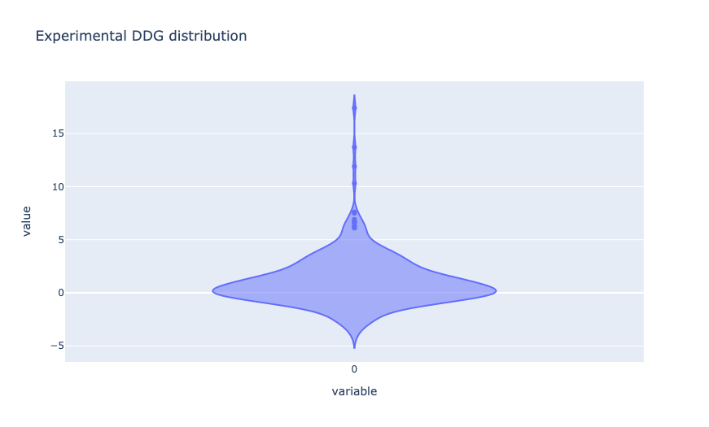
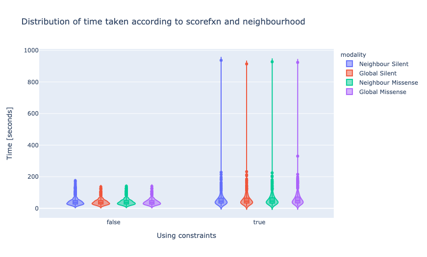
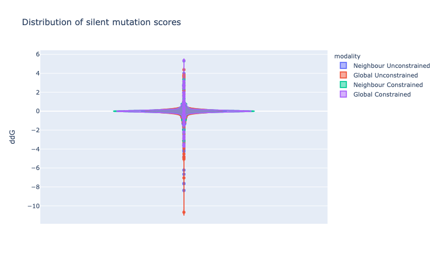
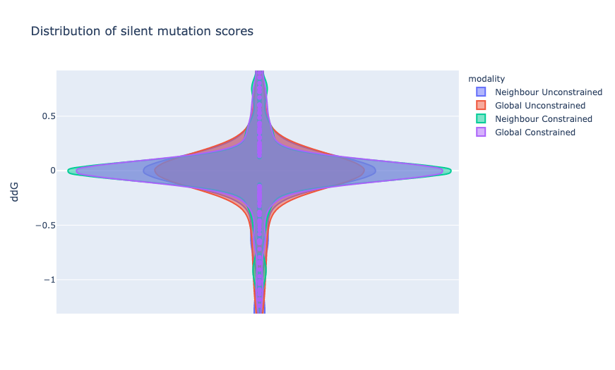
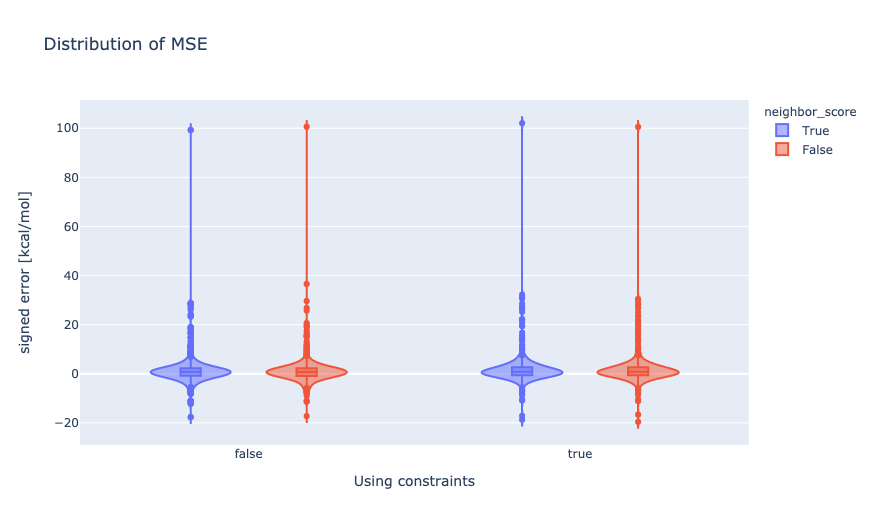
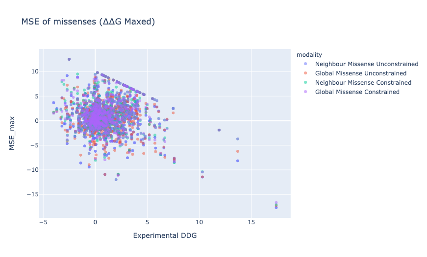
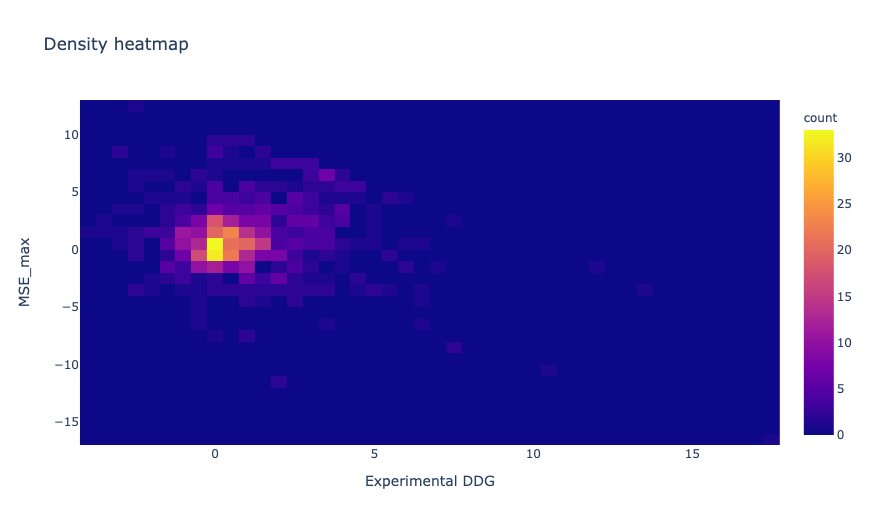
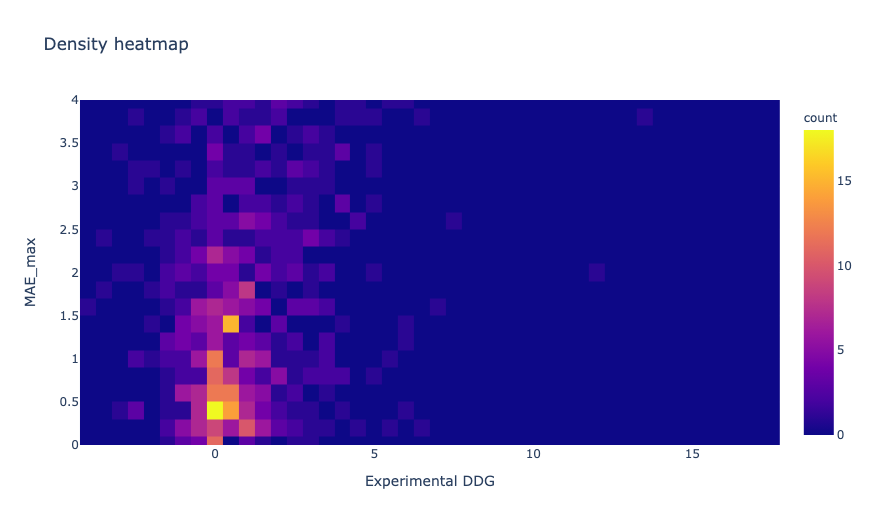

## Analyses part 2

> ¡ Data here is unscaled !

## Note
These are the analysis with ref2015 12Å x3 settings. Testing

* scoring globally or only neighbourhood
* constraining the boundary of the neighbourhood
* preventing relax from outputting a worse value

```python
import json
import pandas as pd
pd.options.mode.chained_assignment = None
import numpy as np
from sqlitedict import SqliteDict

from IPython.display import display, HTML

def entitle(*args, header='h1'):
    content = ' &mdash; '.join(map(str, args))
    display(HTML(f'<{header}>{content}</{header}>'))
    
# -----------------

db_scores = SqliteDict('neoscores.db', encode=json.dumps, decode=json.loads, autocommit=True)
scores = pd.DataFrame(dict(db_scores.items())).transpose()
scores['constraints'] = scores.constraints.fillna(False)
scores['silent'] = scores.silent.fillna(False)
scores['Experimental DDG'][scores.silent] = 0.
scores['MSE'] = (scores['ddG'] - scores['Experimental DDG']).astype(float)
scores['MAE'] = scores['MSE'].apply(abs).astype(float)
scores['has_pro'] = scores.mutation.str.contains('P')
scores['time'] = scores.time.astype(float)
scores['ddG'] = scores.ddG.astype(float)
scores['neighbor_score'] = scores.neighbor_score.astype(bool)
scores['silent'] = scores.silent.astype(bool)
scores['constraints'] = scores.constraints.astype(bool)
scores['ddG_max'] = scores['ddG'].apply(lambda g: g if abs(g) < 10 else 10 * np.sign(g))
scores['MSE_max'] = (scores['ddG_max'] - scores['Experimental DDG']).astype(float)
scores['MAE_max'] = scores['MSE_max'].apply(abs).astype(float)
scores['settings'] = (scores.score_fxn + 
                      ' @ ' + scores.radius.astype(str) + 'Å x' + scores.cycles.astype(str)
                     )
scores['modality'] = scores.neighbor_score.map({True: 'Neighbour', False: 'Global'}) \
                        + ' ' \
                        + scores.silent.map({True: 'Silent', False: 'Missense'}) \
                        + ' ' \
                        + scores.constraints.map({True: 'Constrained', False: 'Unconstrained'})
scores['scoring/constraints'] = scores.neighbor_score.map({True: 'Neighbour', False: 'Global'}) \
                        + ' ' \
                        + scores.constraints.map({True: 'Constrained', False: 'Unconstrained'})
scores['scoring/sense'] = scores.neighbor_score.map({True: 'Neighbour', False: 'Global'}) \
                        + ' ' \
                        + scores.silent.map({True: 'Silent', False: 'Missense'})
focused = scores.loc[(scores.score_fxn == 'ref2015') \
                       & (scores.radius == 12) \
                       & (scores.cycles == 3)]
silent = scores.loc[(scores.score_fxn == 'ref2015')
                       & (scores.radius == 12)
                       & (scores.cycles == 3)
                       & (scores.silent)]
missense = scores.loc[(scores.score_fxn == 'ref2015')
                       & (scores.radius == 12)
                       & (scores.cycles == 3)
                       & (~scores.silent)]
```

The columns on scores are PDB ID, Protherm ID, Residue Number, Chain, Wild Type, Mutation, SASA,
Experimental DDG, Classifiers, PDB_chain, mutation, uniprot, silent, constraints, neighbor_score, 
time, ddG, scores, rmsd, dsol, score_fxn, neighbours, cycles, radius, neighbouring_ligand,
n_constraints, MSE, MAE, has_pro, ddG_max, MSE_max, MAE_max, modality.

### Protherm**

The experimental ddG are not zero centered, therefore that the MSE is positive is no surprise.

```python
import plotly.express as px
fig = px.violin(scores['Experimental DDG'].unique(),
               title='Experimental DDG distribution')

fig.show()
scores.loc[(scores['settings'] == 'ref2015 @ 12Å x3') 
           & (scores['modality'] == 'Global Missense Constrained')]\
      ['Experimental DDG']\
      .astype(float)\
      .describe()
```



count    758.000000
mean       0.970692
std        1.977988
min       -4.000000
25%       -0.110000
50%        0.505956
75%        1.865000
max       17.400000

## Time

Time taken by modality


```python
import plotly.express as px

title = 'Distribution of time taken according to scorefxn and neighbourhood'
fig = px.violin(focused,
                x="constraints",
                y="time",
                color="scoring/sense",
                box=True,
                title=title)
fig.update_layout({'xaxis': {'anchor': 'y', 'title': {'text': 'Using constraints'}},
               'yaxis': {'anchor': 'x', 'title': {'text': 'Time [seconds]'}}})
fig.show()
```



## Silent

The constraint modality was borne out of the fact the MAE of the silent mutations was not zero.
The case for AspD C191C was that the residue D222 in the neighbourhood occasionally moved despite a worse score
due to the bondary residues —specifically PNP, which it is meant to hydrogen bond with a protonated D222
—as it is loaded automatically without human intervention this is obviously going to be problematic.

```python
title = 'Distribution of silent mutation scores'

fig = px.violin(silent,
                y="ddG",
                color='scoring/constraints',
                #points='all',
                violinmode='overlay',
               title=title)
fig.show()
```




## Error distribution

```python
entitle('Mean MSE')
display(missense.groupby('modality').mean()[['time','MSE','MAE']])
entitle('Median MSE')
display(missense.groupby('modality').median()[['time','MSE','MAE']])
```

Mean MSE

| modality                |    time |     MSE |     MAE |
|:------------------------|--------:|--------:|--------:|
| Global Constrained      | 58.522  | 1.62239 | 2.83743 |
| Global Unconstrained    | 40.5254 | 1.16304 | 2.74134 |
| Neighbour Constrained   | 55.1645 | 1.70235 | 2.89917 |
| Neighbour Unconstrained | 40.553  | 1.20262 | 2.79885 |

Median MSE

| modality                |    time |      MSE |     MAE |
|:------------------------|--------:|---------:|--------:|
| Global Constrained      | 48.2406 | 0.808442 | 1.61542 |
| Global Unconstrained    | 36.623  | 0.684385 | 1.64821 |
| Neighbour Constrained   | 45.6122 | 0.819774 | 1.59716 |
| Neighbour Unconstrained | 36.5599 | 0.706789 | 1.66674 |

```python
import plotly.express as px

title = 'Distribution of MSE'

fig = px.violin(missense,
                x="constraints",
                y="MSE",
                color="neighbor_score",
                box=True,
                title=title)
fig.update_layout({'xaxis': {'anchor': 'y', 'title': {'text': 'Using constraints'}},
               'yaxis': {'anchor': 'x', 'title': {'text': 'signed error [kcal/mol]'}}})
fig.show()
```


```python
fig = px.scatter(subscores,
                x="Experimental DDG",
                y="MSE",
                color="modality",
                opacity=0.5,
                hover_data=['mutation'],
                title=f'MSE of missenses',
                )
fig.show()
```


The major problem is the outliners dragging everything to ruin —hence why the median is pretty decent.

```python
fig = px.scatter(subscores,
                x="Experimental DDG",
                y="MSE_max",
                color="modality",
                opacity=0.5,
                hover_data=['mutation'],
                title=f'MSE of missenses (∆∆G Maxed)',
                )
fig.show()
```



| modality                         |    time |         MSE |     MSE_max |      MAE |   MAE_max |
|:---------------------------------|--------:|------------:|------------:|---------:|----------:|
| Global Missense Constrained      | 58.522  |  1.62239    |  1.08065    | 2.83743  |  2.2859   |
| Global Missense Unconstrained    | 40.5254 |  1.16304    |  0.717215   | 2.74134  |  2.30009  |
| Global Silent Constrained        | 54.7768 |  0.00818619 |  0.00818619 | 0.219593 |  0.219593 |
| Global Silent Unconstrained      | 40.161  | -0.0691334  | -0.0682423  | 0.488845 |  0.487954 |
| Neighbour Missense Constrained   | 55.1645 |  1.70235    |  1.11       | 2.89917  |  2.29909  |
| Neighbour Missense Unconstrained | 40.553  |  1.20262    |  0.745165   | 2.79885  |  2.32966  |
| Neighbour Silent Constrained     | 54.4259 |  0.0121679  |  0.0121679  | 0.218641 |  0.218641 |
| Neighbour Silent Unconstrained   | 41.4071 | -0.116161   | -0.116161   | 0.501304 |  0.501304 |

Pearson &rho; normal:

* Neighbour Missense Unconstrained p=0.322
* Global Missense Unconstrained p=0.326
* Neighbour Missense Constrained p=0.338
* Global Missense Constrained p=0.34

Capped to 10 kcal/mol:

* Neighbour Missense Unconstrained p=0.446
* Global Missense Unconstrained p=0.455
* Neighbour Missense Constrained p=0.49
* Global Missense Constrained p=0.489

Capped and without proline in the mutation and without a ligand in the neighbourhood

* Neighbour Missense Unconstrained p=0.427
* Global Missense Unconstrained p=0.447
* Neighbour Missense Constrained p=0.492
* Global Missense Constrained p=0.491

Note that a scatter plot (even with 50% opacity) is misleading as seen by density heatmap

```python
glomiscon = scores.loc[(scores['settings'] == 'ref2015 @ 12Å x3') 
           & (scores['modality'] == 'Global Missense Constrained')]
fig = px.density_heatmap(glomiscon,
                        x="Experimental DDG",
                        y="MAE_max",
                        nbinsx=50, nbinsy=100,
                        title='Density heatmap')
fig.update_layout(yaxis=dict(range=[0, 4]))
fig.show()
```




The distribution of MAE is very non-normal as expected.
The constraints seem to improve the median, but not the mean, but the latter is what is reported in the litterature
even if it is affected by outliers.

Likewise the neighbourhood score is marginally better than the global score.

```python
focused.groupby('modality').MAE.describe()
```

| modality                         |   count |     mean |      std |         min |        25% |       50% |      75% |       max |
|:---------------------------------|--------:|---------:|---------:|------------:|-----------:|----------:|---------:|----------:|
| Global Missense Constrained      |     758 | 2.83743  | 5.27695  | 0.00150892  | 0.684486   | 1.61542   | 3.18792  | 100.522   |
| Global Missense Unconstrained    |     758 | 2.74134  | 4.98224  | 0.0055146   | 0.747683   | 1.64821   | 3.03327  | 100.613   |
| Global Silent Constrained        |     758 | 0.219593 | 0.509158 | 5.25825e-05 | 0.00594246 | 0.0346334 | 0.179812 |   5.33308 |
| Global Silent Unconstrained      |     758 | 0.488845 | 1.01525  | 2.26149e-05 | 0.00534177 | 0.0482515 | 0.467131 |  10.6754  |
| Neighbour Missense Constrained   |     758 | 2.89917  | 5.4867   | 0.00284924  | 0.735846   | 1.59716   | 3.25576  | 102.038   |
| Neighbour Missense Unconstrained |    1516 | 2.79885  | 5.02042  | 0.00147952  | 0.749352   | 1.66674   | 3.02179  |  99.2664  |
| Neighbour Silent Constrained     |     665 | 0.218641 | 0.479524 | 1.8018e-05  | 0.00988034 | 0.0313394 | 0.155608 |   5.30973 |
| Neighbour Silent Unconstrained   |    1516 | 0.501304 | 0.998134 | 4.41781e-05 | 0.0210831  | 0.0775789 | 0.473746 |   8.37244 |

## Categories

```python
from scipy.stats import pearsonr

entitle('categories')

gloconmiss = scores.loc[(scores.score_fxn == 'ref2015')
                       & (scores.radius == 12)
                       & (scores.cycles == 3)
                       & ~scores.silent.astype(bool)
                       & scores.constraints.astype(bool)
                       & ~scores.neighbor_score.astype(bool)]

cs = []
for c in gloconmiss.Classifiers.unique():
    sub = gloconmiss.loc[gloconmiss.Classifiers == c]
    if len(sub) > 10:
        pearson = pearsonr(sub["Experimental DDG"], sub.ddG)[0]
    else:
        #pearson = np.nan
        continue
    cs.append(dict(classifier=c,
                  samples=len(sub),
                  MAE=sub.MAE.mean(),
                  MdAE=sub.MAE.median(),
                  pearson = pearson
                  )
             )
    
cat_summary = pd.DataFrame(cs)
cat_summary.sort_values('MdAE', ascending=False)
```

|    | classifier                                                                  |   samples |       MAE |     MdAE |    pearson |
|---:|:----------------------------------------------------------------------------|----------:|----------:|---------:|-----------:|
| 22 | 'involves proline' 'buried'                                                 |        30 | 11.1328   | 4.08637  |  0.127966  |
| 14 | 'hydrophobic to polar' 'hydrophobic to positive' 'buried'                   |        11 |  3.54844  | 3.07432  |  0.0537191 |
| 21 | 'involves proline' 'surface'                                                |        19 |  7.95399  | 3.06808  |  0.773085  |
| 17 | 'non-charged polar to positive' 'buried'                                    |        12 |  2.54483  | 2.59397  |  0.425332  |
|  2 | 'hydrophobic to hydrophobic' 'buried'                                       |        39 |  2.90614  | 2.53187  |  0.507037  |
| 10 | 'small to large' 'hydrophobic to polar' 'hydrophobic to positive' 'buried'  |        16 |  5.96432  | 2.52662  |  0.490555  |
| 19 | 'charge to charge' 'buried'                                                 |        13 |  2.03884  | 2.19387  |  0.626907  |
| 11 | 'hydrophobic to polar' 'hydrophobic to negative' 'buried'                   |        22 |  4.08687  | 2.17029  |  0.591341  |
| 15 | 'non-charged polar to negative' 'buried'                                    |        28 |  1.91958  | 2.01108  |  0.689062  |
| 23 | 'involves cysteine' 'buried'                                                |        34 |  2.2353   | 1.94058  |  0.150491  |
| 13 | 'negative to non-charged polar' 'buried'                                    |        33 |  2.32583  | 1.92778  |  0.494118  |
|  3 | 'polar to hydrophobic' 'negative to hydrophobic' 'buried'                   |        31 |  3.43944  | 1.88421  |  0.612406  |
|  6 | 'hydrophobic to polar' 'hydrophobic to non-charged polar' 'buried'          |        40 |  2.09775  | 1.81486  |  0.552779  |
|  0 | 'polar to hydrophobic' 'non-charged polar to hydrophobic' 'buried'          |        27 |  2.03889  | 1.68966  |  0.538786  |
|  5 | 'non-charged polar to non-charged polar' 'buried'                           |        27 |  2.03574  | 1.58369  |  0.634175  |
|  7 | 'large to small' 'polar to hydrophobic' 'positive to hydrophobic' 'surface' |        35 |  1.61248  | 1.25501  |  0.461017  |
| 16 | 'negative to positive' 'buried'                                             |        22 |  3.65379  | 1.24905  |  0.258546  |
| 18 | 'negative to non-charged polar' 'surface'                                   |        17 |  1.54235  | 1.21232  |  0.465303  |
|  1 | 'non-charged polar to negative' 'surface'                                   |        13 |  1.95733  | 1.03325  | -0.0446289 |
|  4 | 'positive to non-charged polar' 'surface'                                   |        30 |  1.5797   | 1.01029  |  0.735425  |
| 12 | 'polar to hydrophobic' 'non-charged polar to hydrophobic' 'surface'         |        11 |  1.17806  | 0.979569 | -0.385673  |
| 20 | 'charge to charge' 'surface'                                                |        20 |  1.95525  | 0.908232 | -0.100289  |
|  8 | 'negative to positive' 'surface'                                            |        24 |  0.885381 | 0.649784 |  0.154023  |
|  9 | 'positive to negative' 'surface'                                            |        28 |  1.31606  | 0.592727 |  0.592778  |