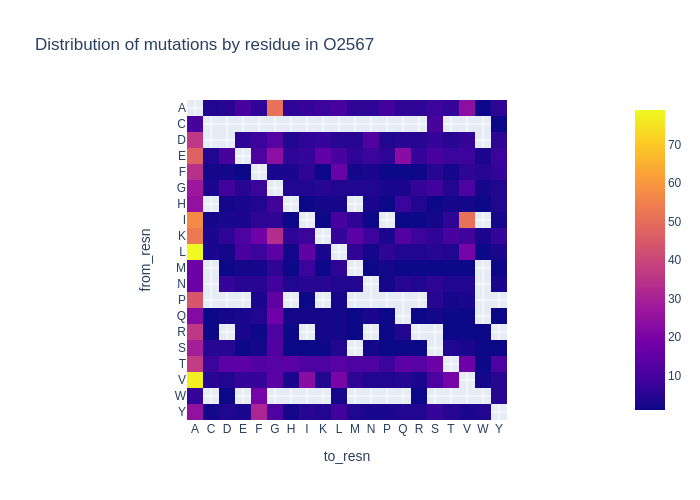
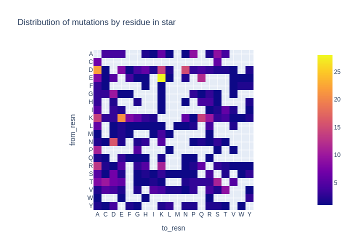
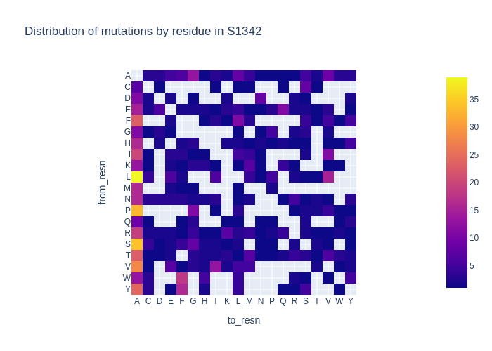

## Distribution of residues

Example of one of the difference: distribution of residue changes.
The Alanine column reflects the commonality of alanine scans in the inital dataset.
This criterion is just one of many and does not indicate which dataset is better,
just that they differ.

