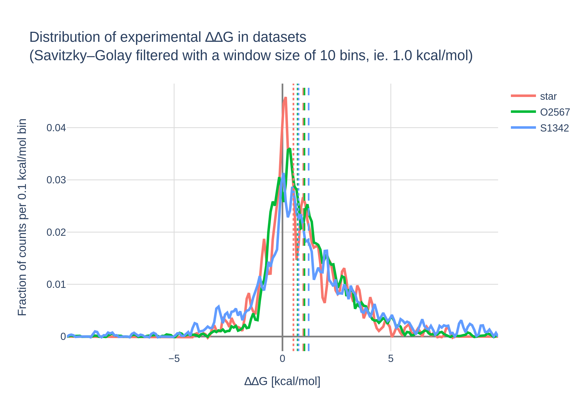

# Scoring

For previous iterations of scoring see [notes](notes).
In this version the major differences are:

* the reference tables are made consistent as opposed to the analyses changing the names for them
* More distributed runs
* extra dataset

The previous dataset were re-run as the codebase had changed a bit.

## Rectification

The standaridised datasets end in `.standarised.csv` (NB :uk: not :us:) and are in [standardised_inputs folder](standardised_inputs).

Code for the process is in [dataset rectification notes](standardised_inputs/dataset_rectification.md).

## Scoring

Scoring was done via the script `score_dataset.py`, which can be called with the
arguments `dataset_name`, `dataset_filename`, `protein_filename`, `settings_filename`, `max_workers`
e.g.

    >>> python3 score_dataset.py test test.csv O2567_protein.p settings.json 10    

Or imported as a module. Example:

```python
from score_dataset import TableScorer
dataset_name = 'star'
TableScorer.test_one(dataset_name,
                     dataset_filename=f'{dataset_name}.standarised.csv',
                     database_filename=f'{dataset_name}-test.db',
                     protein_filename=f'{dataset_name}_protein.p',
                     settings_filename='debug_settings.json')
```

The majority of the calculations were done via the former. Dask stopped working on the SGE cluster for MF, 
so the submission were done crudely via [wrapped SGE qsub calls](notes/SGE.md).

The settings (in [settings](settings)) are as follows:


|               |   radius |   cycles | scorefxn_name   | prevent_acceptance_of_incrementor   | neighbour_only_score   | outer_constrained   | single_chain   | remove_ligand   | use_pymol_for_neighbours   |
|:--------------|---------:|---------:|:----------------|:------------------------------------|:-----------------------|:--------------------|:---------------|:----------------|:---------------------------|
| 8x1_reg       |        8 |        1 | ref2015         | True                                | False                  | False               | True           | True            | False                      |
| 12x1_reg      |       12 |        1 | ref2015         | True                                | False                  | False               | True           | True            | False                      |
| 12x2_reg      |       12 |        2 | ref2015         | True                                | False                  | False               | True           | True            | False                      |
| 12x3_reg      |       12 |        3 | ref2015         | True                                | False                  | False               | True           | True            | False                      |
| 15x3_reg      |       15 |        3 | ref2015         | True                                | False                  | False               | True           | True            | False                      |
| 12x2_con      |       12 |        2 | ref2015         | False                               | False                  | False               | True           | True            | False                      |
| 12x2_neigh    |       12 |        2 | ref2015         | True                                | True                   | False               | True           | True            | False                      |
| 12x2_cart     |       12 |        2 | ref2015_cart    | True                                | False                  | False               | True           | True            | False                      |
| 12x2_beta     |       12 |        2 | beta_nov16      | True                                | False                  | False               | True           | True            | False                      |
| 12x2_betacart |       12 |        2 | beta_nov16_cart | True                                | False                  | False               | True           | True            | False                      |

The results were stored using the `SqliteDict`, a pseudo-dictionary which stores data as an SQLite database.

```python
from sqlitedict import SqliteDict
import json
import pandas as pd

db_scores = SqliteDict('S1342-scores.db', encode=json.dumps, decode=json.loads, autocommit=True)
# there are some `None` values:
dict_scores = {k: v for k, v in db_scores.items() if isinstance(v, dict)}
# pandas dataframe
scores = pd.DataFrame.from_dict(dict_scores, orient='index')
```

## Distribution of experimental values

